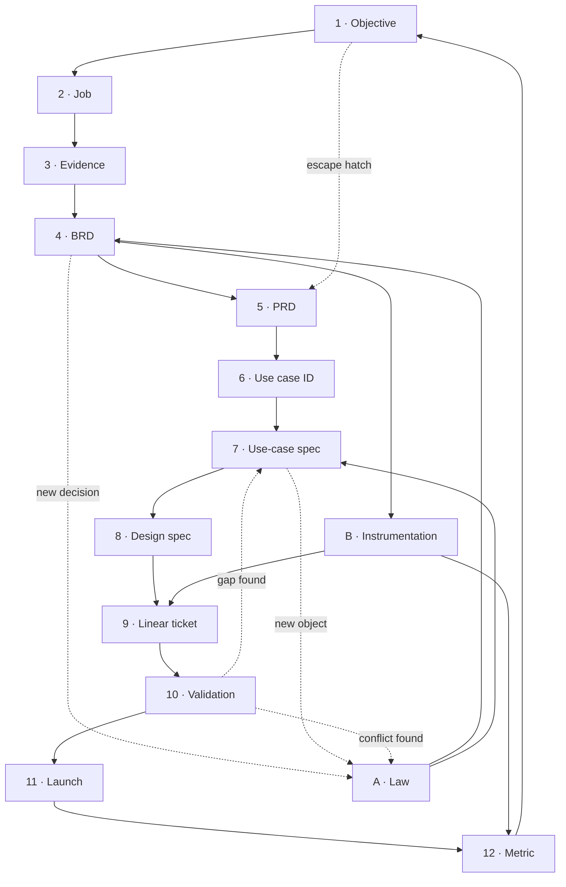

# Artifact flow

**One question:** For any piece of product work, which file holds the answer at each step?
**Read this first** if you are new, or if you are about to write a doc and are not sure where it goes.
**Every node, one click:** [nodes/README.md](./nodes/README.md)
**Last checked:** 2026-08-16

---

## TL;DR

1. **Twelve nodes, one loop.** Objective to metric and back. Shipping is not the end, the objective moving is.
2. **The chain breaks in two places.** Use-case specs (1 of ~80 written) and everything after validation (instrumentation, launch, metric all 🔴).
3. **Law is not a step, it is a two-way sidecar.** It constrains what you may promise and what each step must obey, and it is *produced* by decisions made upstream.
4. Today the loop is **open**: we can prove a feature is built, not that it worked.

---

## Where it goes

| # | Node | Lives | Question it answers | Have it? |
|---|------|-------|---------------------|----------|
| 1 | Objective | [`context/goals.md`](./context/goals.md) | Why this half | ✅ |
| 2 | Job | [`context/personas.md`](./context/personas.md), `work/discovery/outputs/jtbd-*` | Whose problem | ✅ |
| 3 | Evidence | `work/discovery/outputs/` interviews, journey maps | Proof the job is real | ⚠️ 1 interview |
| 4 | **BRD** | [`work/specs/brd/`](./work/specs/brd/) | What the business must be able to do, ranked | ⚠️ 1 (multi-location) |
| 5 | PRD | [`work/specs/prd/`](./work/specs/prd/) | What we build now, and why now | ✅ 2 |
| 6 | Use case ID | [`feature-mappings/<stage>/<feature>.md`](../cami-feature-docs/feature-mappings/) | The named path, one row | ✅ ~80 IDs |
| 7 | Use-case spec | [`work/specs/use-cases/`](./work/specs/use-cases/) | All paths, alternates | ⚠️ 1 written |
| **A** | **Law** | [`business-rules/01-06`](../cami-feature-docs/business-rules/) | What must always hold | ✅ strongest layer |
| 8 | Design spec | [`docs/specs/DSG-*`, `PRO-*`](../../docs/specs/) | What it looks like | ✅ |
| 9 | Linear ticket | `PRO-###` | Who builds it, when | ✅ |
| 10 | Validation | [`validations/<feature>/<ID>.md`](../cami-feature-docs/feature-mappings/) | Is it built | ✅ ~80 |
| **B** | **Instrumentation** | nowhere | How we will know | 🔴 |
| 11 | Launch | nowhere | Who we tell | 🔴 |
| 12 | Metric | nowhere | Did it work | 🔴 |

Numbers are the chain. **Letters are cross-cutting**, they touch several steps and do not sit at one point in time.

---

## The loop

---

## Three things the table hides

| Looks like | Actually |
|---|---|
| **B · Instrumentation** sits near 10, so reads as ticket-time work | Authored at 4 and 5. The BRD's success criteria names the metric, the instrumentation spec makes it real. Write it after the ticket and it never gets built |
| **6 → 7** is one step | For a new initiative there is no feature guide yet. BRD R-numbers spawn the guide, the guide spawns IDs, IDs spawn specs. Multi-location has no guide today |
| **A · Law** is an input | Two-way. PRDs and use-case specs *produce* ADRs and glossary rows. `06 §10` already requires a new money object to add rows to §1 and §3 before Definition of Ready |

**The dotted escape hatch** (objective straight to PRD) is real and sometimes correct. It is also the path Dynamic Pricing took, which `product.md` flags as traceable to no objective, persona job, or decision record. Use it knowingly.

---

## One ID, three files

Nodes 6, 7, and 10 are the same use case at three altitudes. Same ID across all three.

| Layer | File | Answers | Author |
|-------|------|---------|--------|
| Index | `feature-mappings/<stage>/<feature>.md` | Is it done? One row | Product |
| Spec | PMOS `work/specs/use-cases/<stage>/<feature>/<ID>.md` | What should happen, all paths | Product |
| Audit | `feature-mappings/<stage>/validations/<feature>/<ID>.md` | What happens today | Engineering |

A spec never carries build state. A validation never invents a requirement. Alternates carry their own IDs (`CAL-D1.a5`) so a validation can score them.

---

## Which doc am I writing?

| If you are asking | Write | Template |
|---|---|---|
| Is this worth doing at all? | Nothing. Answer it in `goals.md` | — |
| What must the business be able to do, across features? | **BRD** | [`work/_templates/brd.md`](./work/_templates/brd.md) |
| What are we building this release, and what could go wrong? | **PRD** | `/prd-generator` skill |
| What should happen when someone does X, including when it goes wrong? | **Use-case spec** | [`work/specs/use-cases/_template.md`](./work/specs/use-cases/_template.md) |
| What must always be true, everywhere? | **Law** (01-06) | Cite, never restate |
| What does it look like? | **Design spec** | `docs/specs/PRO-XX-*.md` |
| Is it built? | **Validation** | [`validations/_template.md`](../cami-feature-docs/feature-mappings/get-booked/validations/_template.md) |
| Any doc, what shape? | — | [`work/_templates/table-first.md`](./work/_templates/table-first.md) |

---

## Traceability

The chain only pays off if an ID survives the whole lap. Today it does not.

| Link | State |
|---|---|
| Objective → BRD requirement | ⚠️ BRD names its objective, one initiative only |
| BRD R-number → use case ID | ⚠️ column exists on multi-location, zero requirements fully traced |
| Use case ID → spec | 🔴 1 of ~80 |
| Use case ID → Linear ticket | 🔴 INV-11 requires every ticket to cite a rule ID. Nothing checks it |
| Validation → metric | 🔴 no instrumentation, no launch, no metric |

**INV-11:** every rule has an ID and every ticket cites one. That invariant is asserted, not enforced.

---

## The chain in Linear

**Added 2026-08-20.** The chain now has a carrier in Linear, so a project shows which nodes are missing instead of showing only design tickets.

| Chain object | Linear carrier |
|---|---|
| Node 1, Objective | **Initiative**. Projects roll up to it |
| Initiative (Cami sense) | **Project** |
| BRD requirement groups | **Project milestones** |
| Nodes 7 to 12, and A | **Issue**, tagged with the `node` label group |
| Nodes 2 to 5 | Not in Linear. The ticket cites the ID, PMOS holds the artifact |

The `node` label group is workspace-level, 14 values (`01 objective` to `12 metric`, plus `A law` and `B instrumentation`). Group a project view by it and the gaps are visible at a glance.

**Rule this does not change:** Linear carries the trace, not the text. Law and BRDs are never pasted into Linear, they are cited. Two copies drift.

**First use:** [Merchant settlement](https://linear.app/getcami/project/merchant-settlement-fa73a29bdf06). Before labeling, every ticket on it was `08 design`.

---

## Docs in Slite

**Added 2026-08-20.** Slite is where the wider team reads. Traffic runs in both directions and the direction is not negotiable per doc.

| Direction | What moves | Rule |
|---|---|---|
| **Repo → Slite** (mirror out) | `context/knowledge/01` to `06`, and the artifacts you author alone | Repo is the source of truth. Each Slite note carries a "mirrored from the repo" stamp and the file path. Edits made in Slite on these are lost on the next mirror |
| **Slite → repo** (pull in) | Notes the team authors in Slite | Pulled at session start into `context/slite/` by `.claude/hooks/slite-pull.sh`, listed in `.claude/slite-notes.tsv`. Generated, never hand-edited |
| **Neither** | `business-rules/`, `feature-mappings/`, validations | Co-authored with Mike in his repo. Cited by ID, never duplicated |

**The one rule that keeps this honest:** nothing appears in both directions. A doc pulled in must not also be mirrored out, or the two copies overwrite each other on alternate days.

**Mirroring is two steps, not one.** A mirror writes plain markdown, so it wipes the ID links every time. Run `.claude/tools/slite-link-ids.py` straight after any mirror-out, or the citations silently go back to being dead text.

| Step | Command |
|---|---|
| 1. Mirror the doc into Slite | manual, via the Slite API |
| 2. Re-link the IDs | `python3 .claude/tools/slite-link-ids.py` (dry run), then `--apply` |

The linker maps `INV-*` to 01, `ADR-*` and `PDR-*` to 04, `EC-*` to 05, `SET-*` to the settlement BRD, `06 §N` to 06, and `PRO-`/`DSG-`/`PRD-` to the Linear issue. It never links an ID inside the note that defines it, never touches fenced code, and never re-links something already linked. It backs up every note before writing.

**Why the mirror was needed:** the Slite copies of 01 to 05 were three weeks stale (31 Jul against a 16 Aug repo) and 06 was absent entirely. That happened with no process saying which copy won.

---

## Ownership

A node lives where its author works. PMOS holds 1 to 5 and anything you author alone. Nodes 6, A, and 10 stay in `cami-feature-docs`: **engineering authors the validations**, and Mike works in that repo. Node 8 stays in the design repo. Node 7 moved to PMOS because product authors it alone. Full table in [nodes/README.md](./nodes/README.md).

---

## Open decisions

| Decision | Blocks what | Owner | Where it resolves |
|---|---|---|---|
| Who owns nodes 11 and 12, product or commercial? | Launch and metric have no author, which is why they are empty | Michelle + Maaz | goals.md |
| Traceability index: one table mapping rule ID → ticket → test, or a check in CI? | INV-11 enforcement | Michelle + Faisal | New artifact |

---

## Change log

| Date | Change |
|---|---|
| 2026-08-16 | First version. Added BRD as node 4, split Law and Instrumentation out as cross-cutting letters, named the two breaks in the chain |
| 2026-08-16 | BRD moved into PMOS (`work/specs/brd/`). Added the Ownership rule and the [nodes index](./nodes/README.md) |
| 2026-08-20 | Added "The chain in Linear". Node label group created workspace-wide; merchant settlement is the first project carrying it. Nodes 7, B, 11, and 12 now have tickets on that project, which is not the same as having the artifacts |
| 2026-08-16 | Split `work/specs/` into `brd/` · `prd/` · `use-cases/`; `outputs/` stays the skill drop zone. Use-case specs moved from `cami-feature-docs` into PMOS. **Law and guides stay with Mike, pending a conversation with him. Law is never duplicated, PMOS links to it** |
