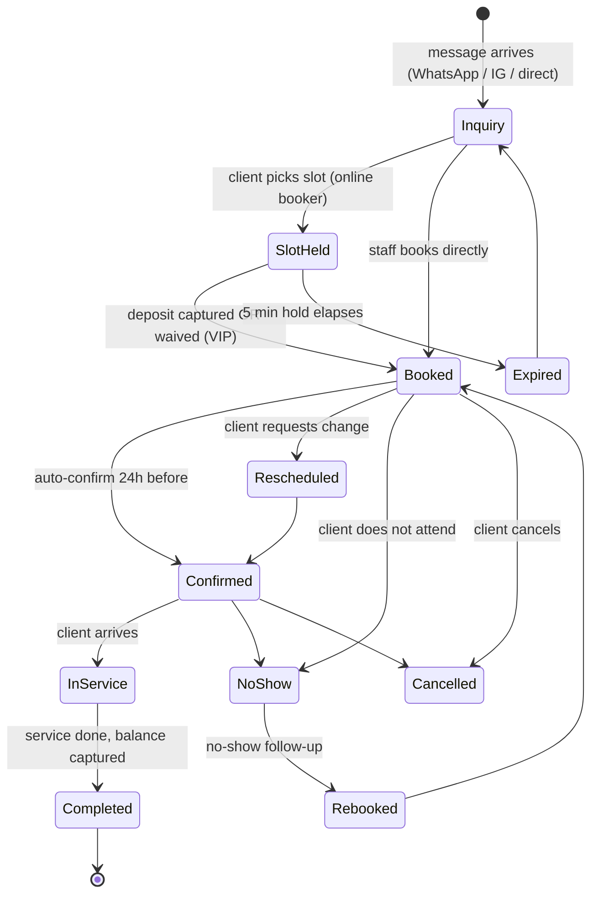
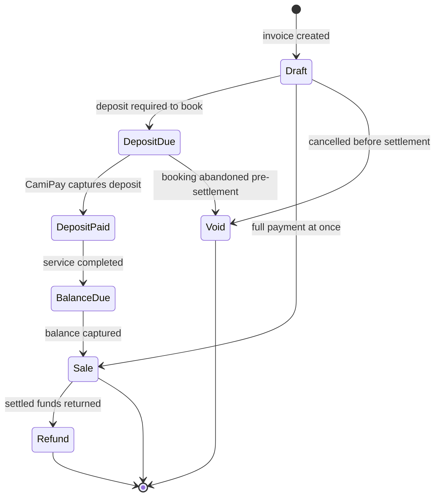
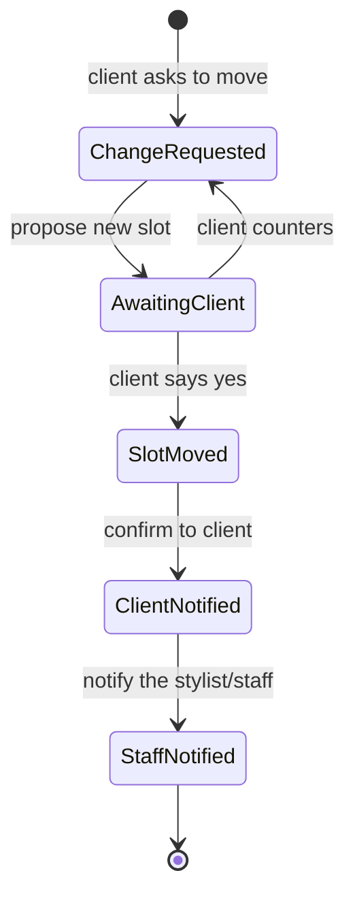
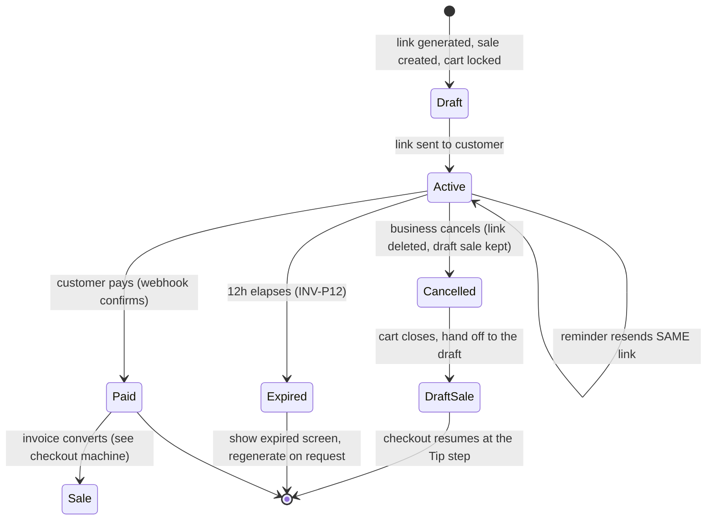
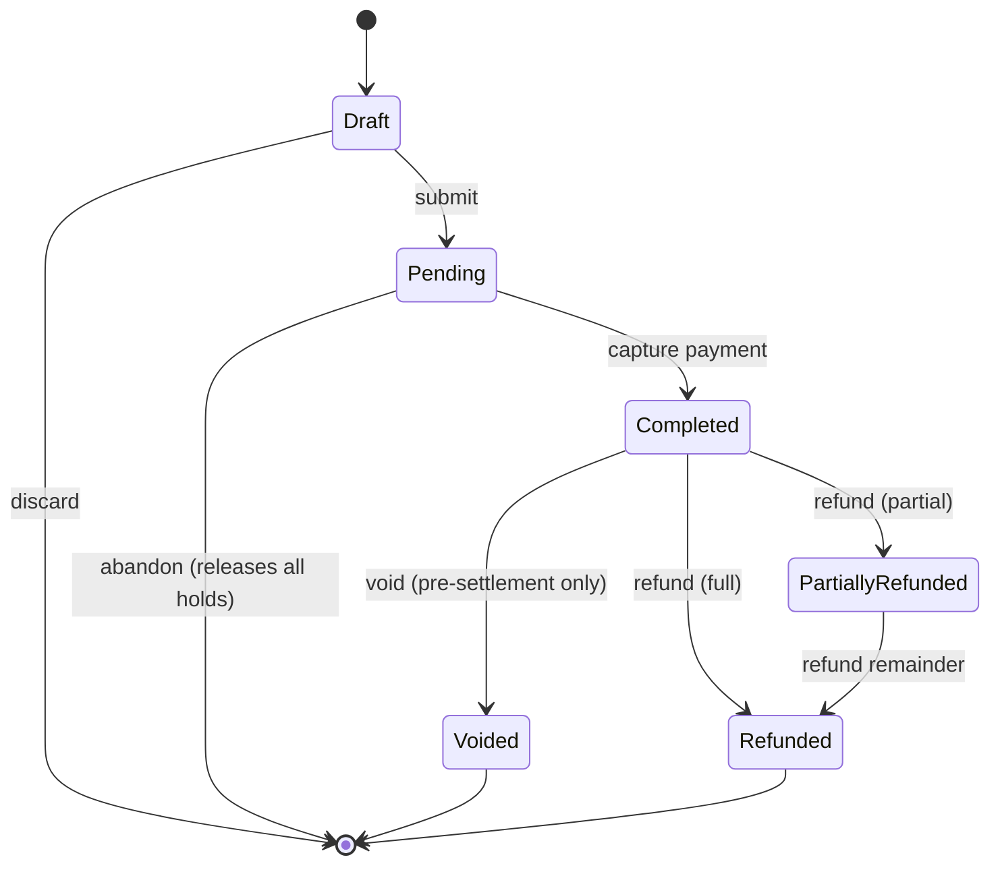
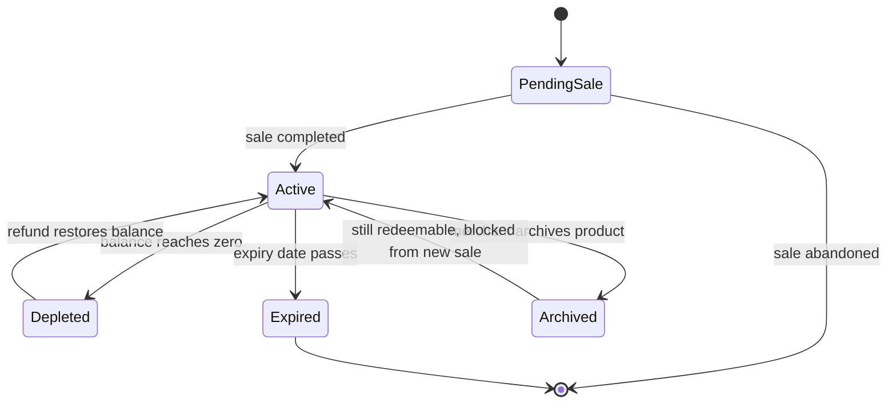
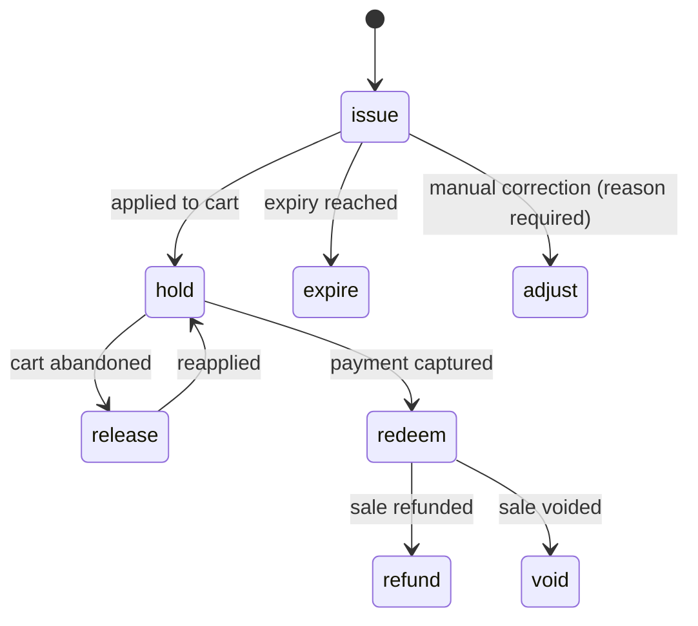
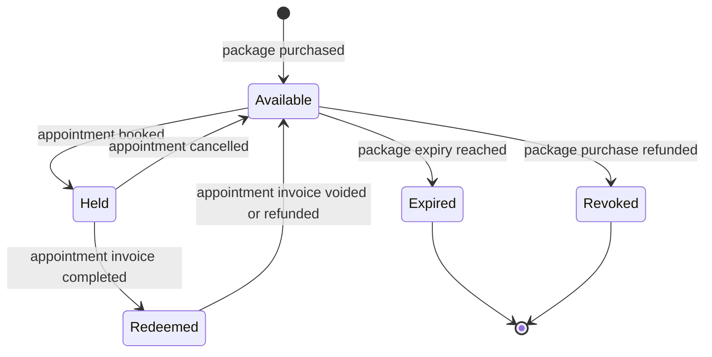
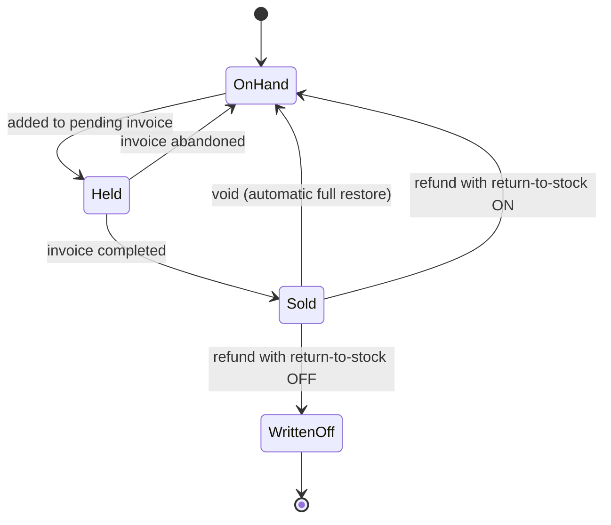
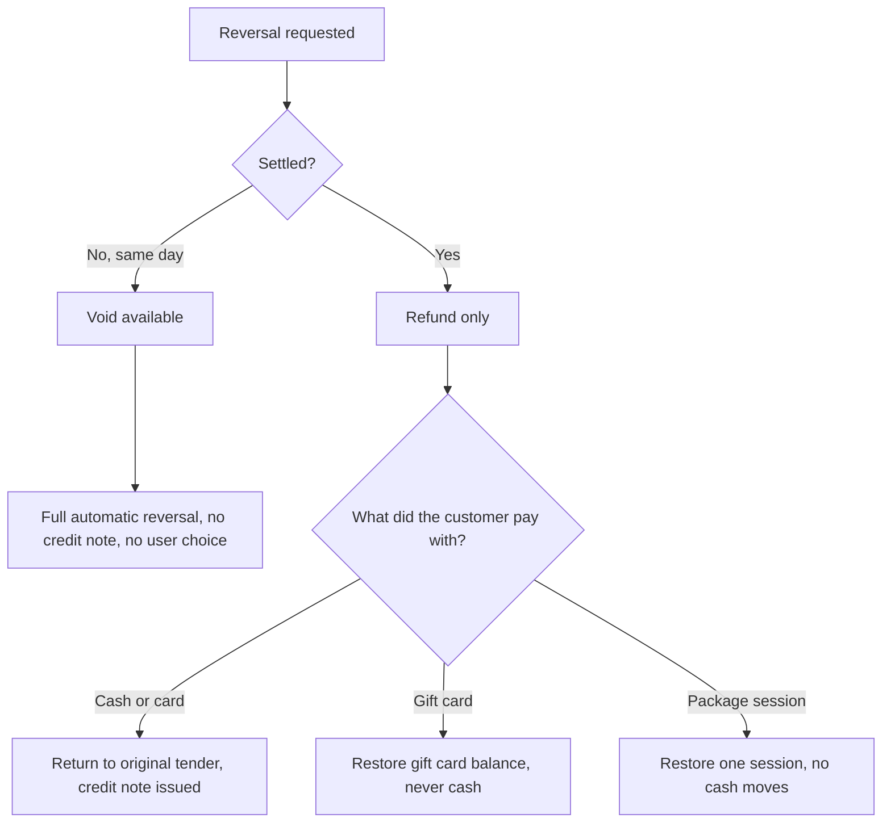

# State Machines
**Last updated:** 2026-08-03 **What this is:** The lifecycle states of every core object, and what moves it between them. This is the contract engineering builds against. The checkout machine is the source of truth for payment states (sale / void / refund glossary, pending Sham and Maz sign-off, marked ⚠️).

**Source:** product.md, goals.md, personas.md, interview-snapshot-queenie.

---

## 1\. Booking lifecycle

<table class="companion-table" style="min-width: 75px;"><colgroup><col style="min-width: 25px;"><col style="min-width: 25px;"><col style="min-width: 25px;"></colgroup><tbody><tr><th colspan="1" rowspan="1">
State
</th><th colspan="1" rowspan="1">
Meaning
</th><th colspan="1" rowspan="1">
Exit triggers
</th></tr><tr><td colspan="1" rowspan="1">
Inquiry
</td><td colspan="1" rowspan="1">
Message received, no slot held
</td><td colspan="1" rowspan="1">
Slot pick, direct book
</td></tr><tr><td colspan="1" rowspan="1">
SlotHeld
</td><td colspan="1" rowspan="1">
Online booker holding a slot (5 min, INV-B1)
</td><td colspan="1" rowspan="1">
Deposit captured, hold expires
</td></tr><tr><td colspan="1" rowspan="1">
Booked
</td><td colspan="1" rowspan="1">
Slot reserved, deposit taken or waived
</td><td colspan="1" rowspan="1">
Confirm, reschedule, cancel, no-show
</td></tr><tr><td colspan="1" rowspan="1">
Confirmed
</td><td colspan="1" rowspan="1">
Auto-confirmed 24h before
</td><td colspan="1" rowspan="1">
In-service, reschedule, no-show, cancel
</td></tr><tr><td colspan="1" rowspan="1">
InService
</td><td colspan="1" rowspan="1">
Client present, service underway
</td><td colspan="1" rowspan="1">
Completion
</td></tr><tr><td colspan="1" rowspan="1">
Completed
</td><td colspan="1" rowspan="1">
Service done, balance captured, invoice closed
</td><td colspan="1" rowspan="1">
Terminal
</td></tr><tr><td colspan="1" rowspan="1">
Rescheduled
</td><td colspan="1" rowspan="1">
Slot moved, client + staff notified
</td><td colspan="1" rowspan="1">
Back to Confirmed
</td></tr><tr><td colspan="1" rowspan="1">
NoShow
</td><td colspan="1" rowspan="1">
Client did not attend
</td><td colspan="1" rowspan="1">
Rebook follow-up
</td></tr><tr><td colspan="1" rowspan="1">
Cancelled
</td><td colspan="1" rowspan="1">
Client cancelled
</td><td colspan="1" rowspan="1">
Terminal
</td></tr><tr><td colspan="1" rowspan="1">
Rebooked
</td><td colspan="1" rowspan="1">
New booking from a no-show/next-visit prompt
</td><td colspan="1" rowspan="1">
Back to Booked
</td></tr></tbody></table>

**Overlap:** a staff-created booking may overlap another on the same staff member (allowed, ungated, trust-based, INV-B7 / ADR-023). The online booker offers only non-conflicting slots, so a customer cannot create an overlap.

**Gaps (see** [**Edge Cases**](05-edge-case-catalog.md "05-edge-case-catalog.md")**):** no cross-channel duplicate detection before Booked (EC-1); reschedule staff-notify chain is manual (EC-7); staff overlaps have no warning or audit (EC-29).

---

## 2\. Checkout / payment lifecycle ⚠️
> Source of truth for payment states. Definitions pending Sham and Maz sign-off. Voucher tax logic is settled: no tax at issuance, tax at redemption.

<table class="companion-table" style="min-width: 75px;"><colgroup><col style="min-width: 25px;"><col style="min-width: 25px;"><col style="min-width: 25px;"></colgroup><tbody><tr><th colspan="1" rowspan="1">
State
</th><th colspan="1" rowspan="1">
Meaning
</th><th colspan="1" rowspan="1">
Money moved?
</th></tr><tr><td colspan="1" rowspan="1">
Draft
</td><td colspan="1" rowspan="1">
Invoice open, nothing captured
</td><td colspan="1" rowspan="1">
No
</td></tr><tr><td colspan="1" rowspan="1">
DepositDue
</td><td colspan="1" rowspan="1">
Deposit required to hold booking
</td><td colspan="1" rowspan="1">
No
</td></tr><tr><td colspan="1" rowspan="1">
DepositPaid
</td><td colspan="1" rowspan="1">
Deposit captured, auto-reconciled to invoice (INV-P7)
</td><td colspan="1" rowspan="1">
Yes (partial)
</td></tr><tr><td colspan="1" rowspan="1">
BalanceDue
</td><td colspan="1" rowspan="1">
Service complete, remainder outstanding
</td><td colspan="1" rowspan="1">
No (pending)
</td></tr><tr><td colspan="1" rowspan="1">
Sale ⚠️
</td><td colspan="1" rowspan="1">
Payment complete against the invoice
</td><td colspan="1" rowspan="1">
Yes (settled)
</td></tr><tr><td colspan="1" rowspan="1">
Void ⚠️
</td><td colspan="1" rowspan="1">
Cancelled before settlement, nothing settled
</td><td colspan="1" rowspan="1">
No
</td></tr><tr><td colspan="1" rowspan="1">
Refund ⚠️
</td><td colspan="1" rowspan="1">
Settled funds returned after a Sale
</td><td colspan="1" rowspan="1">
Yes (reversed)
</td></tr></tbody></table>

**Constraint:** No card stored (INV-P6), so no auto-charge of a no-show fee and no card-on-file recapture. A no-show cannot be auto-billed today (EC-15).

---

## 3\. Deposit lifecycle
<table class="companion-table" style="min-width: 75px;"><colgroup><col style="min-width: 25px;"><col style="min-width: 25px;"><col style="min-width: 25px;"></colgroup><tbody><tr><th colspan="1" rowspan="1">
State
</th><th colspan="1" rowspan="1">
Meaning
</th><th colspan="1" rowspan="1">
Notes
</th></tr><tr><td colspan="1" rowspan="1">
Required
</td><td colspan="1" rowspan="1">
Service has a deposit rule
</td><td colspan="1" rowspan="1">
Per-service %: hair/nails 25%, facials/makeup/SPMU 50%
</td></tr><tr><td colspan="1" rowspan="1">
Waived
</td><td colspan="1" rowspan="1">
VIP waiver applied
</td><td colspan="1" rowspan="1">
Who authorizes the waiver is an open question (EC-3)
</td></tr><tr><td colspan="1" rowspan="1">
Captured
</td><td colspan="1" rowspan="1">
CamiPay took the deposit at booking (INV-B2)
</td><td colspan="1" rowspan="1">
Automatic, not a manual link
</td></tr><tr><td colspan="1" rowspan="1">
Reconciled
</td><td colspan="1" rowspan="1">
Deposit applied against the client invoice
</td><td colspan="1" rowspan="1">
Automated in v1 (INV-P7)
</td></tr><tr><td colspan="1" rowspan="1">
Forfeited
</td><td colspan="1" rowspan="1">
No-show, deposit retained
</td><td colspan="1" rowspan="1">
Manual today; no auto-fee (INV-P6)
</td></tr></tbody></table>

---

## 4\. Reschedule loop (the dominant workload)

**Reality gap:** the StaffNotified step is manual, Queenie walks upstairs because staff do not reply fast on WhatsApp (EC-7). The target is a built-in client-notify plus internal staff-notify chain.

---

## 5\. Consent / intake form
<table class="companion-table" style="min-width: 50px;"><colgroup><col style="min-width: 25px;"><col style="min-width: 25px;"></colgroup><tbody><tr><th colspan="1" rowspan="1">
State
</th><th colspan="1" rowspan="1">
Meaning
</th></tr><tr><td colspan="1" rowspan="1">
Template
</td><td colspan="1" rowspan="1">
Default per business type, business can override
</td></tr><tr><td colspan="1" rowspan="1">
Sent
</td><td colspan="1" rowspan="1">
Delivered over WhatsApp
</td></tr><tr><td colspan="1" rowspan="1">
Signed
</td><td colspan="1" rowspan="1">
E-signed by the client
</td></tr><tr><td colspan="1" rowspan="1">
Stored
</td><td colspan="1" rowspan="1">
Attached to the relevant record
</td></tr><tr><td colspan="1" rowspan="1">
Prefilled
</td><td colspan="1" rowspan="1">
AI auto-populates from the client profile before send
</td></tr></tbody></table>

---

## 6\. Reminder cadence
<table class="companion-table" style="min-width: 100px;"><colgroup><col style="min-width: 25px;"><col style="min-width: 25px;"><col style="min-width: 25px;"><col style="min-width: 25px;"></colgroup><tbody><tr><th colspan="1" rowspan="1">
Step
</th><th colspan="1" rowspan="1">
Timing
</th><th colspan="1" rowspan="1">
Channel (today)
</th><th colspan="1" rowspan="1">
Constraint
</th></tr><tr><td colspan="1" rowspan="1">
Auto-confirm
</td><td colspan="1" rowspan="1">
24h before
</td><td colspan="1" rowspan="1">
SMS (Twilio) / email
</td><td colspan="1" rowspan="1">
Status-only, no URLs (INV-C1)
</td></tr><tr><td colspan="1" rowspan="1">
Reminder
</td><td colspan="1" rowspan="1">
1h before
</td><td colspan="1" rowspan="1">
SMS / email
</td><td colspan="1" rowspan="1">
Location pin allowed; WhatsApp version gated on META
</td></tr><tr><td colspan="1" rowspan="1">
No-show rebook
</td><td colspan="1" rowspan="1">
After a miss
</td><td colspan="1" rowspan="1">
SMS / email
</td><td colspan="1" rowspan="1">
Drives rebooking
</td></tr></tbody></table>

**Open:** per-merchant sender IDs vs Cami-as-sender; the 160-character SMS limit (EC-17). WhatsApp reminders unblock on META verification.

---

## 7\. Slot hold
`Available -> Held (5 min) -> Booked` on deposit/confirm, or `Held -> Available` on expiry. Prevents double-hold from the online booker (INV-B1).

---

## 8\. Payment link lifecycle
> Links are immutable and single-active (INV-P11). Create/delete/expire only, never updated. Sending a link creates the sale in draft and locks the cart (amount + method).

<table class="companion-table" style="min-width: 75px;"><colgroup><col style="min-width: 25px;"><col style="min-width: 25px;"><col style="min-width: 25px;"></colgroup><tbody><tr><th colspan="1" rowspan="1">
State
</th><th colspan="1" rowspan="1">
Meaning
</th><th colspan="1" rowspan="1">
Notes
</th></tr><tr><td colspan="1" rowspan="1">
Draft
</td><td colspan="1" rowspan="1">
Link generated, sale created, cart locked (amount + method)
</td><td colspan="1" rowspan="1">
Repeat clicks return the same link, no duplicates
</td></tr><tr><td colspan="1" rowspan="1">
Active
</td><td colspan="1" rowspan="1">
Link sent, awaiting payment
</td><td colspan="1" rowspan="1">
Reminders reuse the same link (INV-P11)
</td></tr><tr><td colspan="1" rowspan="1">
Paid
</td><td colspan="1" rowspan="1">
Customer paid, webhook confirmed
</td><td colspan="1" rowspan="1">
Converts to Sale; webhook must confirm in seconds (EC-23)
</td></tr><tr><td colspan="1" rowspan="1">
Expired
</td><td colspan="1" rowspan="1">
12h window elapsed unpaid
</td><td colspan="1" rowspan="1">
Sale stays in draft; show expired screen, not blank (EC-20)
</td></tr><tr><td colspan="1" rowspan="1">
Cancelled
</td><td colspan="1" rowspan="1">
Business cancelled, link deleted
</td><td colspan="1" rowspan="1">
Cart unlocks; rebuild from Sales/Appointment (EC-25)
</td></tr></tbody></table>

**Config change** (amount, description, service) invalidates and deletes the active link and generates a new one (INV-P11). **Cancel UI (PRO-909):** the drawer body is replaced by a full-panel `PaymentLinkLockScreen` (reuses the ConfirmationScreen shape, not a dismissable dialog, no expiry countdown). The only action is Cancel; **anyone who can take a sale** can cancel, not owner-only, no dedicated cancel permission (same shape as payment policy), and the cancel **records the actor** (real gate parked to a permissions card, PRO-404). Cancel invalidates the **link only**, not the draft sale, re-enables other methods, closes the cart, and hands off to the draft sale (Sales > Drafts); checkout there resumes at the **Tip** step with the draft's line and client loaded. When the client pays, a `payment.succeeded` socket settles the sale (mock "Mark as paid" stands in until the socket exists). Source: `docs/specs/PRO-909-payment-link-locked-cart.md`. **Resolved (2026-08-06):** the pet parent pays on the **provider's hosted page**; NeoPay-hosted is acceptable for the NeoPay integration, and the Cami-hosted `/[slug]/pay/[token]` page is a design alternative, not required for the NeoPay rail.

---

## 9\. Terminal (POS) session
> Canonical source: design spec `docs/specs/DSG-62-terminal-registration.md` (**supersedes** the merchant-wide-PIN model in `DSG-62-terminal-management.md`). Two credentials per device: a **pairing code** (`TRM-7Q4K2M`, issued once, immutable) binds the hardware to the business; a **sign-in PIN** (`482915`, regenerable, readable) is entered every sign-in. Diverges from the Jul 23 meeting's email-login proposal, and from the Linear backend tickets' merchant-wide HMAC PIN (see note).

`Registered -> Paired` when the device enters its own pairing code (once). `Paired -> SignedIn` when staff enter that terminal's sign-in PIN, opening a `Session` (24h, `SESSION_HOURS`, revocable per session, not person-attributable). `SignedIn -> Idle` (pending-sales list) between sales. Staff set `intended_payment_method = terminal` on a sale in the business app; it stays unpaid but surfaces in the device's pending-sales list (`GET /terminal/sales`, forced to terminal-routed sales, PRO-983), so `Idle -> SaleSelected -> Tap/Insert -> Approved | Declined`. Repeated wrong PINs move the device to `Locked` (that device only). Regenerating a terminal's PIN revokes that terminal's live sessions; the pairing code does not change. The PIN gates sign-in only, not refunds/voids/discounts. While a terminal charge is in progress the sale is **fully locked** (amount + method), matching the payment-link lock (§8); other tenders return only after cancel (Michelle, 2026-08-06).

> **Terminal Phase 1 is "trust the device report", but the provider does charge.** The terminal runs the **provider's on-device pay screens (NeoPay today)**, so the card charge is a real provider charge. The Android app then `POST /terminal/payments/report` with `{saleId, paidAmount, transactionId, status}`, and Phase 1 Cami's backend **trusts** the report rather than confirming server-side: validates `0 < paidAmount ≤ outstanding`, idempotent by `transactionId`, writes `sale_payments` method=`terminal`, runs the same settle engine as other tenders. Decline logs only, sale stays unpaid. Pilot risk: a wrong, delayed, or lost report can make the books diverge from the provider until reconciled. A later server-side gateway confirm is a **planned direction only** (no ticket yet; the `retrieveOrder`/MPGS mechanism is a discussion-doc guess, not committed). Provider is swappable (NeoPay → TapPay → Network International) behind the abstraction (INV-P3). Source: Linear PRO-982 (Phase 1 trusted settlement callback).

> **✅ Resolved (Michelle, 2026-08-06): per-device terminal PIN is law (ADR-022).** Each terminal has its own pairing code + its own sign-in PIN (design `DSG-62-terminal-registration.md`). Eng Phase 1 (`feature/camipay`) shipped a single **merchant-wide** PIN and is the stale side to migrate (eng check 2026-08-02 marks the per-device rule **Fail**; "next: per-device terminals"). Still-open sub-questions: PIN readability (retrievable by any Payment-settings user), session attribution (device vs staff), lockout trigger (PIN vs code), 24h fixed vs configurable.

---

> **Sales-domain state machines (sections 10 to 14).** Incorporated from Michelle's sales-domain state-machine draft (Slite, 2026-07-31). Canonical for the sales/ledger objects. Every new state or transition needs a corresponding business rule.

## 10\. Invoice

- `Completed` is the commit point: stock decrements, sessions redeem, gift-card holds convert to redemptions, revenue recognizes (INV-07).
- Zero-amount invoices follow the identical path, `Pending -> Completed` with tender = Package (INV-09).
- `Voided` and `Refunded` are terminal; a refund cannot be refunded (rule REV-08).
- Void is pre-settlement only; window policy is open (OPEN-01).

> **Reconciliation (business-rules-v2 refunds-and-voids, agreed 2026-08-04).** The Aug-4 product law says there is **no separate `PartiallyRefunded` status** (rule 15): a partially-refunded sale stays `Completed` and carries a refunded-to-date figure plus still-refundable. Treat `PartiallyRefunded` in the diagram as a derived view, not a stored status. Also settled: void is **same-calendar-day only** (rule 13) and **requires a reason** (rule 12); a voided sale is **retained, never deleted**, keeps rendering with a voided marker, and Edit/Share/Email drop away (rule 14); a refund is a **separate negatively-signed document** above the original (rule 8), apportioned across the tenders that paid, defaulting to each original method, may be returned as cash except a **gift-card tender never returns as cash** (rule 9, matches INV-05), and carries back the **tax component** (rule 10). Refund eligibility has three states: nothing captured, fully refunded, partial-refundable-up-to-remaining (rule 4). Every void/refund is audited beyond the 90-day window (rule 11, INV-08).

## 11\. Gift card
Two things move independently: the **card** has a lifecycle, the **balance** is derived from ledger events (INV-03). Do not conflate them.

**Card lifecycle**

Archiving the product affects new sales only; issued cards stay redeemable (INV-02, rule GC-01). A `PendingSale` card still completes if the product is archived mid-flow.

> **Reconciliation (business-rules-v2 gift-cards, agreed 2026-08-04).** Sold-card status set is **Unpaid / Active / Redeemed / Expired** (rule 8); a card is **not redeemable until its sale is fully paid** (`PendingSale`/Unpaid), and staff are warned before saving such a sale. Turning gift cards off **stops selling, not redeeming** (rule 7). Face value and price paid are separate (rule 11); redemption applies at most the lesser of balance and amount owed, surplus stays on the card (rule 13); a gift card cannot buy another gift card (rule 5). **Reverse of a gift-card tender** goes back to the **same card** (replacement if expired/archived), **never cash**. **Voiding the sale that sold a card** kills the card if untouched, but is **blocked once it has been redeemed against** (refund instead).

**Balance ledger events**

Every event is a new row, nothing mutated (INV-03). `hold` prevents two terminals double-spending one card (INV-07). `adjust` is permission-gated and needs a reason (INV-08).

## 12\. Package session

- Sessions are per service, not generic (ADR-020 / PDR-002).
- `Redeemed -> Available` never returns cash; the appointment invoice was AED 0.00 (INV-06).
- Refunding the **package purchase** revokes all remaining sessions; refunding an **appointment** restores one session. Different operations on different invoices.
- Restoring a session to an expired package is open (OPEN-04, EC PKG-E5).

## 13\. Product stock

Void restores unconditionally; refund restores optionally, per line item, quantity-aware, default ON (rules PROD-02, PROD-03). Every movement writes an inventory record linked to the triggering invoice or refund ID.

## 14\. Reversal decision (cross-object)
The rule that governs all four objects above.

The bottom branch is INV-06 made concrete: exactly one outcome fires. Split tender refunds proportionally across each tender (rule REV-05). Highest-risk correctness test: EC REV-E5.

> **Direction vs amount.** This flowchart is canonical for **where** money returns. It says nothing about **how much**. The amount is recomputed by re-running the Composition Order over the remaining lines, see [06 Money Composition Contract](06-money-composition-contract.md) §6. Tip on refund is an open decision (06 §9.2), so this chart has no tip branch yet.

---

## Change log
<table class="companion-table" style="min-width: 50px;"><colgroup><col style="min-width: 25px;"><col style="min-width: 25px;"></colgroup><tbody><tr><th colspan="1" rowspan="1">
Date
</th><th colspan="1" rowspan="1">
Change
</th></tr><tr><td colspan="1" rowspan="1">
2026-08-03
</td><td colspan="1" rowspan="1">
Initial set. Checkout machine flagged pending Sham/Maz sign-off.
</td></tr><tr><td colspan="1" rowspan="1">
2026-08-06
</td><td colspan="1" rowspan="1">
Added section 8 (payment link lifecycle) and section 9 (terminal POS session) from the Jul 20 and Jul 23 CamiPay meetings.
</td></tr><tr><td colspan="1" rowspan="1">
2026-08-06
</td><td colspan="1" rowspan="1">
Incorporated sections 10 to 14 (invoice, gift card, package session, product stock, reversal decision) from Michelle's sales-domain Slite draft.
</td></tr><tr><td colspan="1" rowspan="1">
2026-08-06
</td><td colspan="1" rowspan="1">
Reconciled §8 (link cancel → draft → Tip, PRO-909), §9 (terminal trust-device Phase 1, per-device vs merchant-wide open), §10 (no PartiallyRefunded status), §11 (gift-card statuses + reverse rules) against the design repo and business-rules-v2 docs.
</td></tr><tr><td colspan="1" rowspan="1">
2026-08-06
</td><td colspan="1" rowspan="1">
Corrected §9 terminal to the provider's on-device pay screens (NeoPay today, swappable NeoPay → TapPay → NI); Phase 1 trusts the device report, Phase 2 confirms server-side.
</td></tr><tr><td colspan="1" rowspan="1">
2026-08-06
</td><td colspan="1" rowspan="1">
Added §1 overlap note (staff-side overlap allowed, online non-conflicting only) per ADR-023; softened the §9/ADR-014 Phase-2 claim to planned-only.
</td></tr><tr><td colspan="1" rowspan="1">
2026-08-09
</td><td colspan="1" rowspan="1">
Added a direction-vs-amount note to §14: this layer owns where money returns, 06 Money Composition Contract §6 owns how much. No tip branch until 06 §9.2 resolves.
</td></tr></tbody></table>
