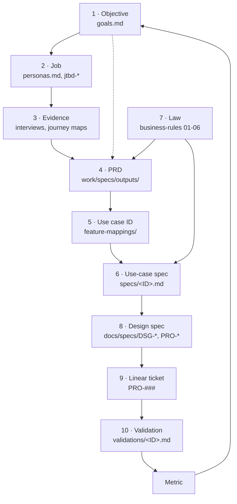

# The chain

**One question:** what has to link to what, so any feature can be traced from the objective it serves down to the code that proves it, and back.

**Use for:** deciding where a new artifact goes, what ID it carries, and what it must cite.
**Law:** INV-11 (every rule has an ID, every ticket cites one). This doc is how INV-11 is actually enforced across artifacts, not just tickets.
**Last updated:** 2026-08-16

---

## TL;DR

1. **Ten links, one spine.** Objective → job → evidence → PRD → use case → use-case spec → law → design spec → ticket → validation, then the metric closes back to the objective.
2. **Use-case ID is the pivot.** The PRD does not invent story IDs. It mints or cites IDs in the existing `FeatureLetter-GroupLetter#` namespace (`C-B1`, `CAL-D1`), and four downstream artifacts hang off that one ID.
3. **Four links are broken today**: objectives, jobs, and PRDs carry no IDs, and product law exists in two copies. Fix table at the bottom.

⚠️ **Evidence:** the downstream half (use case → spec → validation) is real and running in `cami-feature-docs`. The upstream half (objective → job → PRD) is proposed, because those artifacts have no IDs yet.

---

## The spine

---

## The ten links

| # | Link | Lives in | ID | Cites upward | Owner |
|---|---|---|---|---|---|
| 1 | **Objective** | `context/goals.md` | 🔴 none, propose `OBJ-B#` / `OBJ-P#` | Strategic narrative | Product |
| 2 | **Job** | `context/personas.md`, `work/discovery/outputs/jtbd-*` | 🔴 none, propose `JOB-<PERSONA>-##` | Objective | Product |
| 3 | **Evidence** | `work/discovery/outputs/` (interviews, journey maps) | Filename plus date | Job | Product |
| 4 | **PRD** | `work/specs/outputs/prd-*.md` | 🔴 none, propose `PRD-<SLUG>` | Objective, job, evidence, law | Product |
| 5 | **Use case** | `cami-feature-docs/feature-mappings/<stage>/<feature>.md` | ✅ `FeatureLetter-GroupLetter#` (`C-B1`) | PRD | Product |
| 6 | **Use-case spec** | `cami-feature-docs/specs/<stage>/<feature>/<ID>.md` | ✅ same ID | Use case, law | Product |
| 7 | **Law** | `business-rules/01-06` | ✅ `INV-*`, `ADR-*`, `EC-*`, `§N`, Composition Order step | Cited by, does not cite down | Product |
| 8 | **Design spec** | `docs/specs/DSG-*.md`, `PRO-*.md` | ✅ `DSG-##`, `PRO-###` | Use-case ID, law | Design |
| 9 | **Ticket** | Linear | ✅ `PRO-###` | Use-case ID plus a rule ID (INV-11) | Engineering |
| 10 | **Validation** | `feature-mappings/<stage>/validations/<feature>/<ID>.md` | ✅ same use-case ID | Use case, ticket | Engineering |

---

## What each link must cite

One rule per artifact. If it cannot cite, it is not ready.

| Artifact | Must cite | Fails as |
|---|---|---|
| Job | The objective it advances | Discovery with no commercial case |
| PRD | Objective, one or more job IDs, evidence, law depended on and law changed | Feature nobody can trace to strategy (the Dynamic Pricing case) |
| PRD user story | A use-case ID in the feature namespace | Parallel ID scheme, QA reads the wrong list |
| Use-case spec | The law IDs each step obeys | Spec quietly violates an invariant |
| Design spec | The use-case ID it renders | Screens with no requirement behind them |
| Ticket | Use-case ID plus a rule ID | INV-11 breach, bug untraceable to intent |
| Validation | Use-case ID, build state label, evidence | Build state with no requirement to score against |
| ADR | The invariant or decision it supersedes | Two live answers to one question |

---

## The pivot: use-case ID

Everything below the PRD keys off one string. Get this right and the rest is mechanical.

| Rule | Detail |
|---|---|
| Format | `FeatureLetter-GroupLetter#`, for example `C-B1`. Alternates get a suffix, `CAL-D1.a5` |
| Minted by | Product, in the feature guide. If the feature does not exist yet, **the PRD mints the groups and IDs and the guide inherits them** |
| Never renumbered | Linear, QA, design specs, and validations all cite it. Renumbering silently unlinks them |
| Four files per ID | Index row (is it done), use-case spec (what should happen), design spec (what it looks like), validation (what happens today) |
| A spec never carries build state | Build state lives only in the validation. Product does not assert what is built |
| A validation never invents a requirement | If it needs a rule that does not exist, that is a PRD gap, raise it, do not write law in a validation |

---

## Job ID scheme

A flat list per persona becomes unreadable past roughly 15 rows, so jobs group. The group axis is the **operator stage**, reused verbatim from `feature-mappings/MAP.md`, so a job group maps onto a feature group and link 2 to link 5 is mechanical rather than a judgment call each time.

**Format:** `JOB-<ROLE>-<STAGE>#`

| Role | Persona | | Stage | Covers |
|---|---|---|---|---|
| `OWN` | Omar, Owner | | `SET` | Set up shop |
| `MGR` | Khalid, Branch Manager | | `BOOK` | Get booked |
| `RCP` | Layla, Reception | | `WORK` | Do the work |
| `STF` | Sami, Staff | | `PAY` | Get paid |
| `CLI` | Noor, the Payer | | `KEEP` | Keep them coming |
| `AMG` | Dana, Account Manager | | `KNOW` | Know how |
| | | | `HQ` | CamiHQ |

`MGR` (Khalid, Branch Manager) added 2026-08-20, when multi-location's operational jobs had no persona to hang from. `CLI` rather than `PAY` for Noor, so a role code never collides with a stage code. It also matches house terminology, Client not Customer.

| Rule | Detail |
|---|---|
| Assign to the stage where the job is **done**, not where it is felt | Omar feels the reschedule pain, Layla does the work. One home per job, cross-reference from the other persona |
| Never renumber | PRDs cite these. A renumber silently unlinks a PRD from its demand case |
| Numbers are per role and stage, not global | `JOB-OWN-KNOW1` and `JOB-RCP-BOOK1` coexist |
| The jtbd outputs reference the ID, not the reverse | Local numbering ("Opportunity 12") stays inside the discovery output as its scoring rank. `personas.md` owns the ID |
| Carry the evidence label on the row | Several existing jobs are ⚠️ Inferred from a competitor's build with no owner interviewed. The ID must not launder that into fact |

**Exception, single-stage personas.** The stage axis collapses for `CLI` (every job is PAY) and `AMG` (every job is HQ), because those personas live in one stage. For them the group slot uses their own lifecycle instead: Noor by moment (`BOOK` / `PAY` / `AFTER`), Dana by account phase (`ONB` / `OPS` / `NEG` / `RES`). Same ID shape, different axis, declared rather than forced.

---

## Reading the chain in both directions

| I have | I want | Path |
|---|---|---|
| A bug | The intent it violates | Ticket → use-case ID → use-case spec → law ID |
| A law change | Everything it breaks | Law ID → grep use-case specs citing it → their validations |
| An objective | What is actually being built for it | Objective → job IDs → PRDs citing them → their use-case IDs |
| A feature guide row marked Broken | Who owes the fix | Use-case ID → validation → ticket → owner |
| A PRD | Whether it is de-risked | PRD → leading indicators, plus Cagan risk table, plus open questions with owners |
| A design spec | Why the screen exists | `DSG-##` → use-case ID → job ID → objective |

---

## Known breaks

Ranked by what they cost. Each is a small fix, and each one currently forces a human to hold the link in their head.

| # | Break | Cost today | Fix |
|---|---|---|---|
| 1 | **Law exists twice.** `context/knowledge/01-06` and `cami-feature-docs/business-rules/01-06` are both present | Two copies of the invariant registry can drift. A spec citing INV-M3 does not say which copy | Name one canonical, make the other a pointer. Do this before the next law edit |
| 2 | **Objectives have no IDs** | A PRD cannot cite an objective, so nothing enforces strategic fit | Number them in `goals.md`: `OBJ-B1` Land Tier 2, `OBJ-B2` scale base, `OBJ-B3` reforecast economics, `OBJ-P1` to `OBJ-P4` for product goals |
| 3 | **Jobs have no IDs** | The jtbd outputs number opportunities locally ("Opportunity 12"), which is not globally citable | `JOB-<ROLE>-<STAGE>#`, grouped by operator stage. Scheme specified above, not yet applied to `personas.md` |
| 4 | **PRDs have no IDs** | Tickets and specs reference PRDs by filename and date, which breaks on rename | `PRD-<SLUG>` in the header block, stable across versions |
| 5 | **Feature guide rows do not link back to a PRD** | You can trace a bug down to intent, but not up to the commercial reason | Add a `Source` column, or carry the PRD ID on the group line |
| 6 | **Linear `PRO-###` is overloaded** | Same prefix names both design specs in `docs/specs/` and Linear tickets | Not worth renaming. Note the convention: `docs/specs/PRO-###-*.md` is a spec document, bare `PRO-###` is a ticket |

---

## Evidence and confidence

- ✅ Validated: links 5, 6, 7, 8, 9, 10 exist and are in use, per `cami-feature-docs/README.md` and `feature-mappings/README.md`
- ✅ Validated: use-case ID format and the three-file rule, quoted from those READMEs
- ⚠️ Assumed: links 1 to 4 as described. The artifacts exist, the IDs and the citation discipline do not
- 🔴 Unknown: whether any current Linear ticket actually cites a rule ID as INV-11 requires. Not audited

---

## Change log

| Date | Change |
|---|---|
| 2026-08-16 | First version. Mapped the ten links, named the use-case ID as the pivot, listed six known breaks |
| 2026-08-16 | Added the job ID scheme. Grouped by operator stage, reusing the `feature-mappings/MAP.md` axis so a job group maps onto a feature group. Declared the single-stage exception for Noor and Dana |
