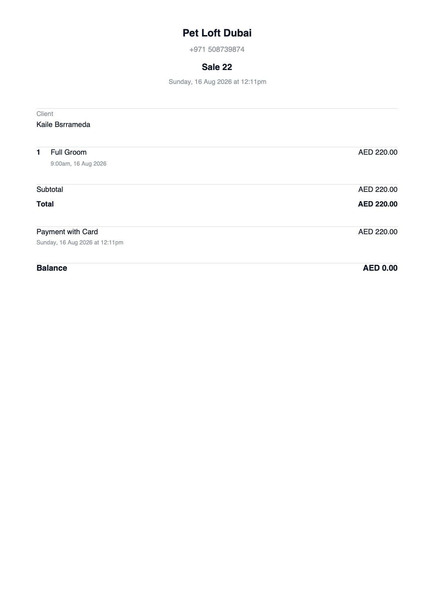

# DSG-72 — Downloadable invoice redesign

**Linear:** [DSG-72](https://linear.app/getcami/issue/DSG-72/downloadable-invoice-redesign) · High · Dsgn
**Depends on:** [PRD-9](https://linear.app/getcami/issue/PRD-9) (TRN + address fields, document type gate, numbering guarantee, QR payload)
**Status:** Draft spec, pending the §2 premise rulings
**Current state:** [Cami today](assets/DSG-72-current-cami.png) (Pet Loft, `Sale 22`, 16 Aug 2026)
**Benchmark:** five Fresha invoices, one per status. [Completed](assets/DSG-72-fresha-completed.png) · [Part paid](assets/DSG-72-fresha-part-paid.png) · [Unpaid](assets/DSG-72-fresha-unpaid.png) · [Refunded](assets/DSG-72-fresha-refunded.png) · [Voided](assets/DSG-72-fresha-voided.png)
**Last updated:** 2026-08-21

---

## TL;DR

| | |
|---|---|
| **What** | One A4 invoice document, rendered identically by PDF download, email attachment, and the unique invoice link |
| **Why** | Cami's downloadable is not FTA-presentable. Titled `Sale 22`, no address, no TRN, and **no VAT row at all**. Raised by Pet Loft (Aziz) |
| **Gap** | Cami is behind Fresha on this surface, and SOTA is switching off Fresha. The benchmark is not aspirational, it is what the Tier 2 anchor already receives today |
| **Where** | `components/blocks/invoice-document.tsx` (shared), demo route `/sales/invoice-document` with query-param state switcher |
| **Not here** | Settings screen for TRN/address, invoice numbering, document type gating logic, QR payload generation (all PRD-9). Arabic and bilingual, deferred |
| **Also fixes** | [EC-39](../../cami%20design%20with%20dotzero/docs/PMOS/context/knowledge/05-edge-case-catalog.md) — a single "total" field on a receipt or export produces a wrong VAT return. This document is the surface that fix lands on |

---

## 0. Two document sets

Do not confuse them. One is what Cami emits, one is what the competitor emits.

### 0.0 What Cami ships today



Pet Loft Dubai, `Sale 22`, 16 Aug 2026. A4 (595 × 841pt, already the right paper). [pdf](assets/DSG-72-current-cami.pdf)

| Present | Absent |
|---|---|
| Business name, phone | **Document type.** Titled `Sale 22`, not `Tax Invoice` |
| Client name | **Registered address** |
| 1 line with an appointment-time sub-label | **TRN** |
| Subtotal, Total, one tender with timestamp, Balance | **Any VAT row.** Subtotal 220.00 = Total 220.00, tax never derived |
| | Recipient address, recipient TRN, per-line tax columns, discount rows, logo, QR, footer, pagination |

This is the ticket's "Why", and it is accurate as written. The absent column is the work.

The missing VAT line is the sharpest of these. Cami stores prices VAT-inclusive (06 §4), so the tax is derivable from data already on the document (`220 × 5/105 = 10.48`), it simply is not rendered. Nothing about the fix is blocked on PRD-9 except the TRN and address values themselves.

### 0.1 The benchmark: five Fresha invoices

Five documents from SOTA, one per status. **These are Fresha output, not Cami's.** Doc #22085 is dated 12 May 2026 and SOTA's Cami go-live was 10 Aug 2026, so they predate the account; the numbering (22085 → 24683) is a long-running incumbent sequence, against Cami's `Sale 22`.

That makes them the competitive bar, not a description of current behavior. SOTA is switching off Fresha, so this is the document quality the Tier 2 anchor is used to receiving. They are also the fixture data for §5, so every screen is comparable to a real document side by side.

| Status | Doc # | Date | Shape | Reference |
|---|---|---|---|---|
| **Completed** | 24683 | 16 Aug 2026 | 1 service, split tender (deposit + balance), Balance 0.00 | [png](assets/DSG-72-fresha-completed.png) · [pdf](assets/DSG-72-fresha-completed.pdf) |
| **Part paid** | 24062 | 19 Jul 2026 | Package with cart discount, one card tender, Balance 1,025.00 | [png](assets/DSG-72-fresha-part-paid.png) · [pdf](assets/DSG-72-fresha-part-paid.pdf) |
| **Unpaid** | 23812 | 9 Jul 2026 | 2 services, named promotion, **no tender rows**, Balance = Total | [png](assets/DSG-72-fresha-unpaid.png) · [pdf](assets/DSG-72-fresha-unpaid.pdf) |
| **Refunded** | 22085 | 12 May 2026 | Separate document referencing #22084, negative lines | [png](assets/DSG-72-fresha-refunded.png) · [pdf](assets/DSG-72-fresha-refunded.pdf) |
| **Voided** | 24588 | 13 Aug 2026 | Gift card sale, voided 7 min after issue | [png](assets/DSG-72-fresha-voided.png) · [pdf](assets/DSG-72-fresha-voided.pdf) |

Status set is **Unpaid / Part paid / Completed / Refunded / Voided**. `Exchanged` is excluded (Michelle, 2026-08-16).

### 0.2 How Fresha expresses status

Two different mechanisms, and the split is deliberate enough to keep.

| Status | Mechanism | Rendered as |
|---|---|---|
| Unpaid | Arithmetic | No tender rows. `Balance` equals `Total` |
| Part paid | Arithmetic | Tender rows for what was collected. `Balance` shows the remainder |
| Completed | Arithmetic | Tenders sum to total. `Balance AED 0.00` |
| Refunded | **Grey subtitle** under the document date | "Refund of original invoice #22084" |
| Voided | **Grey subtitle** under the document date | "Invoice was voided on Thursday, 13 Aug 2026 at 12:44pm" |

**The principle worth keeping:** payment states are carried by the numbers, exceptional states get a line of prose. No badge chips anywhere. A badge is an app affordance; this is a financial document, and a document that says its own condition in a sentence survives a photocopy better than a colored pill.

**Where it breaks:** see §0.4, the void subtitle is far too quiet, and Unpaid renders a bare gap.

### 0.3 What Fresha gets right, and Cami should adopt

| Observation | Evidence | Why it matters |
|---|---|---|
| VAT derived from a **tax-inclusive** gross | `450 × 5/105 = 21.43` (completed) · `2,375 × 5/105 = 113.10` (part paid) · `200 × 5/105 = 9.52` (unpaid) | Exactly 06 §4 and INV-M2. Contract and reality agree. Never introduce an ex-VAT-plus-tax layout |
| **Gift card sale carries no VAT** | Voided: Subtotal 1,250 = Total 1,250, no VAT row | Correct per INV-P8 and ADR-007. No tax at issuance, tax at redemption. Preserve this |
| Deposit + balance renders as split tender with per-tender timestamps | Completed: 112.50 on 15 Aug, 337.50 on 16 Aug. 112.50 is 25% of 450, the hair/nails deposit rule (INV-B3) | The INV-P5 / ADR-014 flow already reads correctly on paper |
| **Promotion and cart discount are distinguished** | Unpaid names it "20% off · Promotion (Discount)"; part paid says only "Cart discount" | Two different objects per the glossary: promotion is owner-configured, cart discount is ad-hoc. The reference is right to name one and not the other |
| Discounted lines show the new price with the **original struck through** | Part paid: `AED 2,375.00` over `~~AED 2,850.00~~`. Unpaid: same on both lines | Answers the "discount column" question. No column needed, strikethrough plus a sub-label carries it |
| Totals block already has the discount rows | `Items total (excl. discounts)` → `Cart discount` → `Subtotal` → `VAT 5%` → `Total` | Live vocabulary. Adopt it rather than inventing labels, see §3.1 |
| Line sub-label carries the appointment datetime | Completed and unpaid | Date of supply, doing its job without a dedicated row |
| Gift card line carries code and expiry | Voided: "Code: FSMWURGW, expires on Aug 13, 2027" | Keep |
| `Balance` always renders | All five | Load-bearing, it is the entire Unpaid / Part paid / Completed signal |
| Refund is a **separate document with its own number** | 22085 refunding 22084 | Confirms §2.2. The product law and the shipped behavior already agree |

### 0.4 What Fresha gets wrong, and Cami must not inherit

The actual DSG-72 work list.

| # | Gap | Evidence | Severity | Fixed in |
|---|---|---|---|---|
| 1 | **The refund reverses no VAT.** Credit note shows Subtotal −20.00, Total −20.00, and no VAT row at all | Refunded #22085 | **Compliance defect.** 03 §10 rule 10 requires the refund to carry back the tax component. As shipped, output tax is overstated after every refund | §2.2, §3.2 |
| 2 | **The refund is titled "Tax Invoice".** It is a credit note | Refunded #22085 | **Compliance.** A negative tax invoice is not the same instrument as a credit note (INV-04, glossary) | §2.2 |
| 3 | **The refund line is a generic "Refund Amount".** No reference to which line items were reversed | Refunded #22085 | High. 06 §6 requires recomputing the Composition Order over the refunded lines. A lump sum cannot be reconciled or partially re-refunded | §3.2 |
| 4 | **Void is a grey subtitle and nothing else.** The document reads as fully paid, `Balance AED 0.00`, and looks completely legitimate | Voided #24588 | **High.** This is the exact scenario the ticket names: a voided invoice keeps its number and can circulate. One grey line at 60 percent opacity does not stop that | §6 |
| 5 | **Unpaid renders a bare gap.** Two horizontal rules with nothing between them where tenders would be | Unpaid #23812 | High. Reads as a rendering bug, not as "unpaid" | §5, §4 block 7 |
| 6 | **Single `Total`.** None of the five has a tip, so taxable gross and amount due are equal by luck. Add a tip and the VAT base is misreported | All five | **Blocking.** This is EC-39 | §3.1 |
| 7 | No recipient address, no recipient TRN | All five | Blocks a VAT-registered client recovering input VAT, the ticket's stated why. Makes all five **simplified** invoices, see §2.1 | §4 block 3 |
| 8 | No per-line unit price, tax rate, or tax amount columns | All five | Required for a full tax invoice. Hidden because every fixture is qty 1 | §4 block 5 |
| 9 | No QR block | All five | Reserved space, see §2.3 | §4 block 8 |
| 10 | No logo slot | All five | Text-only identity | §4 block 2 |
| 11 | No page N of M, no repeating header | All five single-page | A 30-line invoice has no defined behavior | §7 |
| 12 | No footer, no legal text | All five | | §4 block 9 |
| 13 | **US Letter, 612 × 792pt** | All five | Ticket specifies **A4 only**. Wrong paper size for the market | §4 |
| 14 | Header centered, body left-aligned | All five | No grid discipline. Identity, title, and date stack centered, spending the top third of the page that the recipient, meta, and QR blocks need | §4 |
| 15 | Address string is inconsistent between documents | "Regina Tower, Dubai" vs "Regina Tower, Dubai (District 12)" | Low, but a **registered address** is a legal field. It should not drift between invoices from one location | PRD-9 |
| 16 | Emoji in the client name renders as a missing glyph | Unpaid: "Kelsey Stratford ⭐️" | Low. Merchants type emoji into name fields as VIP markers. Font fallback must not produce tofu on a legal document | §4 block 3 |

### 0.5 What is still unsampled

Six documents cover a lot, but every Cami-side state except Completed is unseen. Before the screens are called done, pull the Cami equivalents:

| Missing sample | Why it matters |
|---|---|
| ~~A Cami refund document~~ | **SAMPLED 2026-08-21 — see §0.6 finding 22.** Cami emits a separate document with its own number (Refund 242 against Sale 241), and the original stays `Completed`. §2.2 confirmed on the Cami side, not just the benchmark |
| A Cami voided invoice | Whether any void marker exists at all today |
| A Cami unpaid or part-paid invoice | Whether `Balance` behaves, and what the empty tender area looks like |
| A Cami invoice with a discount | Whether discount rows exist at all, and what they are called |
| ~~A Cami invoice with a tip~~ | **SAMPLED 2026-08-21 — see §0.6.** Live Sale 387 confirms EC-39 in production, and worse than modelled: the tip is silently folded into `Total` and lands exactly where VAT would |
| A Cami gift-card sale | Whether the no-VAT-at-issuance rule (INV-P8) holds, or whether the missing VAT row is hiding a wrong answer |
| Any invoice from a merchant with a logo | The logo slot is untested |

---

## 0.6 Live Cami sample: Sale 387, the tip case

Supplied 2026-08-21 (Hussain). Dot Zero 2 → Haroon Zafar, 20 Aug 2026, a package redemption with a tip. Both the invoice-link view and the PDF were captured. This is the first Cami sample of the tip case, and it closes the sharpest gap in §0.5.

**What the document shows:**

```
Post Prod Service                         AED 100.00
Subtotal                                  AED 100.00
Total                                     AED 105.00
Payment with Customer Package             AED 100.00
Payment with Cash                         AED   5.00
Balance                                   AED   0.00
```

**The AED 5.00 is a tip. The document never says so.** There is no tip row: it is folded into `Total` with no label.

### Why this is worse than §0.4 gap 6 predicted

5% VAT on 100.00 is **exactly AED 5.00**. So the 100.00 → 105.00 step reads as a textbook VAT line, and the two defects mask each other perfectly:

| | Document implies | Actually true |
|---|---|---|
| Nature of the 5.00 | VAT at 5% on 100.00 | A tip, outside the VAT base |
| Output tax on this sale | 5.00 | 4.76 (the tax contained in the 100.00) |
| Taxable base | 100.00 ex-VAT | 95.24 ex-VAT |

An accountant handed this books AED 5.00 of output VAT that was never charged, and never books the 4.76 that was. EC-39 is not theoretical on the Cami side any more — it is shipping, and it is self-concealing. This single document is the strongest available argument for the two-row totals block in §3.1.

The correct rendering, and what `?state=zero-value-tip` shows:

```
Post Prod Service                         AED   0.00   (Covered by Customer Package, retail 100.00)
Subtotal (excl. VAT)                      AED   0.00
Total (incl. VAT)                         AED   0.00
Tip                                       AED   5.00
Amount due                                AED   5.00
Payment with Cash                         AED   5.00
Balance                                   AED   0.00
```

### Two further findings from the same sample

| # | Finding | Detail |
|---|---|---|
| 17 | **Package redemption renders as a full-value tender, contradicting 06 §1** | Live Cami shows the line at 100.00 and `Payment with Customer Package AED 100.00` as a tender. The Money Composition Contract says a redemption renders the line at **zero gross** and is **neither a discount nor a tender** (06 §1, §2 step 3). Both settle to Balance 0.00, but they are different documents and only one can be right. Design follows the contract; see §9 Q13 |
| 18 | **The invoice-link view carries a green `Completed` badge chip** | The PDF does not. §5 rules out badge chips on the document, so the redesign drops it on both surfaces — payment state is carried by `Balance`. Flagging it so its absence is not read as a regression when the link view is reviewed |
| 19 | **The in-app sale dialog names the tip; the document hides it** | On the same sale, the operator's sale detail dialog renders an explicit `Tips AED 5.00` row. The downloadable document does not — it folds the 5.00 into `Total`. Cami already knows the tip is a separate figure and states it internally; only the customer-facing document loses it. That makes this a rendering defect on one surface, not a missing-data problem |
| 20 | **The same tender is labelled differently on each surface** | The sale dialog shows `Payment · Session package`; the PDF shows `Payment with Customer Package`. One tender, two names. Whatever the redemption model turns out to be (Q13), the label has to be one string both surfaces use |

| 21 | **The link view and the PDF are two different designs** | Captured 2026-08-21 from `business.getcami.io/invoice/<uuid>`. The link view is a card on a dark hero band: green `Completed` chip, `BILLED TO`, date as "Thursday, August 20, 2026", tender as `Payment With Package`. The PDF is a centred document: no chip, `Client`, date as "Thursday, 20 Aug 2026 at 7:53pm", tender as `Payment with Customer Package`. Same sale, different title casing, different date format, different labels, different field order. **The ticket's Done-when — "PDF, email attachment, and link view are consistent in content and field order" — is already violated before any of the compliance gaps are counted.** Both surfaces also share all three core gaps (no TRN, no address, no VAT row) and both hide the tip |

| 22 | **Cami DOES emit a separate refund document with its own number — §2.2 confirmed** | Captured 2026-08-21. Live Sale 241 (Completed, AED 1,900) and **Refund 242** (Refunded, −AED 1,900) are two rows in the listing with two detail dialogs. The refund dialog is titled `Refund`, carries its own number, and repeats the reversed line. The original keeps its number, stays `Completed`, and gains `Refund −1,900` / `Total refunded −1,900` rows. This is exactly what INV-04 requires and what §2.2 predicted, and it **closes the single biggest unknown in §0.5 / Q12** |
| 23 | **Production titles it `Refund`; §2.2 requires `Credit Note`** | A negative tax invoice is not the same instrument as a credit note (INV-04, glossary). The design uses `Credit Note`. Whether production's wording changes is a product call, but the two cannot both be right |
| 24 | **The refund carries a reason, shown in-app: "Product defect or damage"** | Rendered under the refund tender in the sale dialog. Whether it belongs on the customer-facing document is undecided — the same question §6 answers "no" for the void reason. See Q15 |

| 25 | **The refund document's line, subtotal and total are all POSITIVE. Only the tender is negative** | Refund PDF (Sale 242, 29 Jul 2026): `Cargo Pants AED 1900.00`, `Subtotal AED 1900.00`, `Total AED 1900.00`, then `Refund via Cash − AED 1900.00`, `Balance AED 0.00`. **Worse than the benchmark** — Fresha at least signs its lines negative (§0.4 gap 1). Sale 241 and Refund 242 both report `Total AED 1900.00`, so summing `Total` across the two documents gives **AED 3,800 of revenue on AED 1,900 of trade**. Revenue overstated by the full refund, on top of the overstated output tax |
| 26 | **The refund PDF is titled `Sale 242`**, with `Refund Sale` as a bold subtitle | So the printed document does not call itself a refund at all, let alone a credit note. Finding 23 is worse than the listing suggested: only the in-app listing says "Refund" |
| 27 | **The refund PDF names no VAT and no original invoice** | Confirms Q10 on the Cami side, not just the benchmark: **no VAT reversal**, so output tax is overstated after every refund. And unlike Fresha, which prints "Refund of original invoice #22084", Cami's refund cites nothing — a client or auditor holding it cannot tie it to the sale it reverses |
| 28 | **The refund reason does not print** | "Product defect or damage" is captured and shown in-app (finding 24) but is absent from the PDF. Answers Q15 descriptively; whether it *should* print is still the design call |
| 29 | **The original invoice's PDF does not admit it was refunded** | Sale 241's PDF shows `Payment with Cash AED 1900.00` / `Balance AED 0.00` and no refunded-to-date row, while the in-app dialog shows `Refund −1,900` and `Total refunded −1,900`. So a printed, fully-paid-looking invoice stays in circulation for money that came back — the same risk §6 built the void watermark for. §2.2 requires the original to carry a refunded-to-date figure; this is the surface where that lands |

### Production's sale-detail actions, confirmed

Captured 2026-08-21. `Share invoice` on the sale detail dialog opens a **modal layered over the sale** — it does not navigate away. Contents: a read-only invoice URL with a copy button (`https://business.getcami.io/invoice/<uuid>`), then Gmail / WhatsApp / More options.

That URL is the ticket's "unique invoice link", so this modal is the doorway to the document.

All four actions were captured. **Not one of them navigates the operator away from the sale** — recorded because that fixes the shape of every action, and any flow that sends the operator to a full-page document is wrong.

| Action | Production behaviour |
|---|---|
| **Share invoice** | Modal over the sale: read-only invoice URL + copy button, then Gmail / WhatsApp / More options. Choosing a target **also copies the link** and toasts "Invoice link copied — paste it into the email body if it doesn't appear automatically" — Gmail's compose URL drops a prefilled body often enough that a silent failure would otherwise send an empty email |
| **Email** | Modal: "Email invoice", one prefilled **Client email** field (opened with the value selected), Cancel / Send. No document preview |
| **Print** | Renders the document to a real PDF, opens it in a new tab as a `blob:` URL in the browser's PDF viewer, and **the print dialog appears by itself** |
| **Download PDF** | Same `blob:` PDF in a new tab, **no print dialog** — the operator saves from the viewer's own download control |

**Where the design repo cannot match this, and why.** Print and Download PDF reach a `blob:` PDF because a backend renders the document to a PDF binary. This repo has no PDF generator — the document is React plus print CSS — so both open the document in a new tab and the browser's print dialog, whose "Save as PDF" destination is the only route to a file here. The Print/Download distinction is preserved (`autoprint=1` on Print only). A capability gap, not a design difference: the document is identical either way.

Three separate captures of the printed PDF (Print, Download PDF, and the earlier link view) all show `Subtotal AED 100.00` / `Total AED 105.00` with no tip row, while the sale dialog beside them shows `Tips AED 5.00`. Finding 19 is not a one-off render.


---

## 1. Regulatory basis

UAE VAT Executive Regulation Article 59. Two invoice types exist in law, not one.

| Field | Full tax invoice | Simplified tax invoice |
|---|---|---|
| The words "Tax Invoice", prominent | Required | Required |
| Supplier legal name | Required | Required |
| Supplier address | Required | Required |
| Supplier TRN | Required | Required |
| Unique sequential number | Required | Required |
| Date of issue | Required | Required |
| Date of supply, when different from issue | Required | Not required |
| Recipient name | Required | Not required |
| Recipient address | Required | Not required |
| Recipient TRN | Required, when registered | Not required |
| Description of goods or services | Required | Required |
| Unit price, quantity, tax rate, amount payable, per line | Required | Not required |
| Discount shown | Required, when applied | Not required |
| Gross amount payable | Required | Required (total consideration) |
| VAT amount payable in AED | Required | Required (total VAT) |
| Reverse charge declaration | Required, when applicable | Not applicable |

**When a simplified invoice is permitted:** the recipient is not VAT-registered, **or** the recipient is VAT-registered and the consideration does not exceed AED 10,000.

**Why this matters for Cami:** almost every Cami transaction is a service business selling to a consumer. The default case is a **simplified** tax invoice, not a full one. The full tax invoice exists for the minority case the ticket names explicitly, a VAT-registered client recovering input VAT, which requires their TRN on the document.

---

## 2. Three premise corrections

Raised because each one changes the screen count. Building against the superset in the meantime, so no work is wasted whichever way they land.

### 2.1 Document type is three-way, not two-way

Ticket story 2 says: "Tax Invoice" when the business has a TRN, "Invoice" when it does not.

That is correct but incomplete. It collapses full and simplified into one. Both say "Tax Invoice"; they differ in whether the recipient block and per-line tax columns are required.

| Type | Trigger | Recipient block | Line-level tax columns | Date of supply |
|---|---|---|---|---|
| **Tax Invoice (full)** | Business has TRN **and** recipient TRN is captured | Required, full | Required | Required when different |
| **Tax Invoice (simplified)** | Business has TRN, recipient is a consumer | Optional, collapses to name only | Optional, totals-level tax is sufficient | Not required |
| **Invoice** | Business has no TRN | Optional | None. No tax wording anywhere | Not required |

**Confirmed on both sides.** Fresha carries the recipient's name, email, and phone but no address and no TRN, and has no per-line tax columns: a **simplified** tax invoice, which is the correct default for a consumer-facing service business. Cami carries less still, a client name and no tax at all, so it is not a tax invoice of either kind. The ticket's stated why is the minority case: a VAT-registered client needs the **full** form to recover input VAT.

**Recommendation:** render the full-invoice field set for every type and let optional fields collapse (§5). One layout, three data states. Do not build three layouts. The simplified type is a strict subset of the full type, so a full-shaped document is always legally sufficient, never insufficient.

**Needs a ruling:** does Cami ever emit a deliberately reduced simplified layout, or always the superset with collapse? Recommendation is the superset.

### 2.2 "Refunded" is not a status on this document

Ticket lists Status: Paid, Unpaid, Partial, Refunded, Void.

Product law disagrees on one of those. Per [INV-04](../../cami%20design%20with%20dotzero/docs/PMOS/context/knowledge/01-product-invariants.md) and business-rules-v2 refunds-and-voids (agreed 2026-08-04, rule 8 and rule 15):

- A refund is a **separate, negatively-signed document with its own document number**, sitting above the original.
- The original sale **stays `Completed`**. There is no `PartiallyRefunded` status. It carries a refunded-to-date figure and a still-refundable figure.

So the document set is two documents, not one document with five statuses:

| Document | Statuses |
|---|---|
| **Tax invoice / invoice** | Paid, Unpaid, Part paid, Void |
| **Credit note** (refund) | Issued |

**Fresha already does this, and Cami's behavior is unknown.** [#22085](assets/DSG-72-fresha-refunded.png) is a separate document with its own number, refunding 22084, with negative lines and a "Refund of original invoice #22084" subtitle. That matches product law (INV-04). No Cami refund document was available, so **what Cami emits on refund is an open item, not a settled one** (§9 Q12). Design the credit note either way, since law and benchmark agree on the shape.

Fresha's version has three defects Cami must not copy (§0.4 gaps 1 to 3):

| Defect | Fresha #22085 | Required |
|---|---|---|
| No VAT reversal | Subtotal −20.00, Total −20.00, **no VAT row** | Refund carries back the tax component (03 §10 rule 10). Without it, output tax is overstated after every refund |
| Titled "Tax Invoice" | "Tax Invoice 22085" | "Credit Note 22085". A negative tax invoice is not the same instrument (INV-04, glossary) |
| Generic lump-sum line | `-1 · Refund Amount · −AED 20.00` | The reversed line items, so the Composition Order can be recomputed over them (§3.2) |

### 2.3 The QR block justification is KSA, not UAE July 2026

Ticket says: "UAE e-invoicing lands July 2026 and the QR stops being optional once Cami merchants are in scope."

Research does not support that as stated:

| Claim | Finding |
|---|---|
| UAE e-invoicing lands July 2026 | July 2026 is the **pilot**. Large business live 1 Jan 2027, SMEs 1 Jul 2027. Cami merchants are SMEs, so 2027 |
| Scope | **B2B and B2G only** at launch. B2C is not covered. Cami merchants sell to consumers, so mostly out of initial scope |
| Mechanism | Peppol 5-corner, structured **XML (PINT AE)** transmitted through an Accredited Service Provider. Not a QR printed on a PDF |
| QR on the printed document | **KSA ZATCA** mandates a TLV-encoded QR on **simplified (B2C)** invoices. That is exactly Cami's transaction shape, in the market Cami is gated on ([INV-A3](../../cami%20design%20with%20dotzero/docs/PMOS/context/knowledge/01-product-invariants.md)) |

**Conclusion: keep the reserved QR block, change the reason.** The block earns its space for KSA ZATCA, where a QR on a B2C simplified invoice is mandatory and TLV-encoded. It does not earn its space for UAE Peppol, which is an XML transmission problem, not a document layout problem.

This also means the ticket's "space is held so the layout is not re-cut later" logic still holds, and the QR block dimensions should be sized to a **ZATCA TLV payload**, not a Peppol one.

**Needs a ruling:** confirm the QR block is reserved for KSA ZATCA. If so, PRD-9's "QR payload generation" is a KSA-gated dependency, not a UAE July 2026 one, and its urgency drops.

---

## 3. Money display rules

Non-negotiable. Sourced from [06 Money Composition Contract](../../cami%20design%20with%20dotzero/docs/PMOS/context/knowledge/06-money-composition-contract.md). Every rule below cites the contract clause it implements.

| Rule | Source | Consequence for the document |
|---|---|---|
| Prices are stored **VAT-inclusive**. VAT is **derived, never appended** | 06 §4 | The line table cannot use the Western "unit price ex-VAT, then + VAT" shape. Unit price and line total are both tax-inclusive. VAT is shown as an "of which" figure, not an addition |
| `VAT = gross × 5 / 105`, rounded once per line, half-up | 06 §7, INV-M2 | Per-line VAT column is a derivation, not an input. Never round at subtotal, never twice |
| **Taxable gross and amount due are different figures whenever a tip exists**. Both must appear | 06 §4, EC-39 | The totals block has two bottom lines, not one. A single "Total" field is a defect on this document |
| `amount_due = taxable_gross + tip` | INV-M3 | Tip sits below the VAT summary, outside the tax base |
| Tip is **outside the VAT base** | INV-M5 | Tip line carries no tax column value. Never folded into taxable gross |
| Package redemption renders the line at **zero gross**, and it is neither a discount nor a tender | 06 §1, §2 step 3 | Redeemed lines still print at full retail description, with a zero line total and the covering package named |
| A **zero-amount invoice is a valid invoice** and lists line items at full retail | INV-09 | The AED 0.00 case is fully headed, fully itemized, covering tender named. Not an empty document |
| Gift card is a **tender**, never a discount. It never reduces taxable gross | 06 §1, §3 | Gift card appears only in the tender block, never in the line table or the discount line |
| Deposit is a **tender at capture**, and is deferred revenue until service render | INV-P10, ADR-013 | The tax invoice is dated at service render, not at deposit capture. A captured deposit appears in the tender block |
| Cart discount is allocated back pro-rata; the fils residue goes to the line with the largest post-discount gross, ties broken by lowest line ID | 06 §7 | The document must render the allocated per-line figure, not re-derive it. Two systems must produce byte-identical output |
| `Σ tender = amount_due` at settled state. Change due is **not** a payment line | INV-M4, glossary | Cash overtender shows a Change line that does not increase collected |

### 3.1 Totals block, exact order

The part-paid and unpaid references already ship a discount-aware totals block. Adopt their vocabulary rather than inventing labels. One word collides and one row is missing.

**The collision.** The reference labels `Subtotal` as the **net, VAT-exclusive** figure (2,261.90), while the Money Composition Contract uses `taxable gross` for the **VAT-inclusive** figure (2,375.00). Same numbers, opposite meaning of the same word. Resolve it on the document by qualifying the label, not by renaming it, so SOTA clients are not handed a new vocabulary.

**The missing row.** None of the five references has a tip, so `Total` and amount due are equal by luck. That is EC-39 waiting to happen.

**Recommended block**, the part-paid fixture ([#24062](assets/DSG-72-fresha-part-paid.png)) with a tip added to expose what Fresha hides:

```
Items total (excl. discounts)       AED 2,850.00   ← Σ line gross pre-discount, VAT-incl. LIVE LABEL
Cart discount                      −AED   475.00   ← hides at zero. LIVE LABEL
────────────────────────────────────────────
Subtotal (excl. VAT)                AED 2,261.90   ← + "(excl. VAT)" qualifier added
VAT 5%                              AED   113.10   ← Σ round(line gross × 5 / 105). LIVE LABEL
Total (incl. VAT)                   AED 2,375.00   ← taxable gross. + "(incl. VAT)" qualifier added
Tip                                 AED   100.00   ← NEW ROW. Outside the tax base
────────────────────────────────────────────
Amount due                          AED 2,475.00   ← NEW ROW. Taxable gross + tip
────────────────────────────────────────────
Payment with Card                   AED 1,350.00      Sunday, 19 Jul 2026 at 2:12pm
────────────────────────────────────────────
Balance                             AED 1,125.00
```

Changes from the live document: two qualifiers, two new rows. Everything else is what SOTA already sends.

| Rule | Reason |
|---|---|
| `Total (incl. VAT)` and `Amount due` are **both always rendered**, even when the tip is zero and the two are equal | Suppressing one when they match is how EC-39 comes back. All five references suppress it and are correct only by accident |
| Qualify `Subtotal` as `(excl. VAT)` and `Total` as `(incl. VAT)` | Kills the collision without renaming a label a client already recognizes |
| Keep `Items total (excl. discounts)` verbatim | Live label, ties to the line table. An accountant can add the column and get this number |
| Discount rows sit **above** the VAT derivation | Discounts reduce the base before derivation (06 §4) |
| The discount row is **named when the discount is a promotion**, generic when it is an ad-hoc cart discount | The reference already does this: "20% off · Promotion (Discount)" vs "Cart discount". Two different objects (glossary) |
| `Tip` sits **below** `Total (incl. VAT)` and carries no tax figure | INV-M5, tip is outside the tax base |
| Tenders listed after `Amount due`, each with its own timestamp | Matches Fresha, which is right about this |
| `Balance` always renders | §5, it is the entire payment-state signal |

### 3.2 Refund composition

The credit note recomputes, it does not subtract a number.

| Rule | Source | Against Fresha |
|---|---|---|
| Refund recomputes the Composition Order over the **refunded lines**, and shows them | 06 §6 | Reference shows a lump `Refund Amount`. Fix |
| The refund **carries back the tax component** | 03 §10 rule 10 | Reference shows no VAT row at all. **Fix, this is the compliance defect** |
| A refund never returns more to a tender type than that tender contributed | 06 §6 | Reference is single-tender, untested. Split-tender refund apportions per tender (rule 9) |
| Gift-card tender reverses to the **same gift card, never cash** | INV-05, 03 §11 | Untested on these fixtures. Needs a screen |
| Tip on refund | **Unresolved**, 06 §9.2 | Blocks the credit note screen. §9 Q6 |

A refunded AED 20.00 line out of a 5 percent-inclusive sale carries AED 0.95 of VAT. The credit note must say so.

---

## 4. Anatomy

A4 portrait, 210 × 297 mm. Print-first: the on-screen link view is the same document in a viewport frame, not a separate design.

> Fresha is **US Letter, 612 × 792pt**. A4 is 595 × 842pt: narrower and taller. Every measurement taken off Fresha has to be re-derived, not scaled. A4 loses 17pt of width and gains 50pt of height, so the line table gets tighter and the page gets one or two more rows before it breaks.

Layout discipline Fresha lacks: it centers the identity block, the document title, and the date, then left-aligns everything below, spending the top third of the page on four centered lines. A4 with a recipient block, a meta block, and a reserved QR block cannot afford that. Identity goes top-left (with the logo slot), meta and document number top-right, recipient below identity.

| # | Block | Contents | Collapse behavior |
|---|---|---|---|
| 1 | **Document title** | "Tax Invoice" or "Invoice" or "Credit Note". Prominent, top | Never collapses. Drives all tax wording below |
| 2 | **Business identity** | Logo, legal name, registered address, TRN, contact | Logo slot collapses when none uploaded; name shifts up. Name, address, TRN never collapse when type is Tax Invoice |
| 3 | **Recipient** | Name, address, TRN | Whole block collapses when consumer with name only. Name-only variant renders as a single line, not a stub block |
| 4 | **Meta** | Document type + number, date of issue, date of supply (when different), and the **status subtitle** for Refunded and Voided only. No badge chips, see §5 | Date of supply hides when equal to issue. Status subtitle absent for Unpaid, Part paid, Completed |
| 5 | **Line item table** | Description, qty, unit price (incl.), discount, tax rate, tax amount, line total | Tax rate + tax amount columns drop entirely on the Invoice (no-TRN) type. Discount column drops when no line carries one |
| 6 | **Totals** | Per §3 | Discount line hides at zero. Taxable gross and Amount due never hide |
| 7 | **Tender** | Method, last-4 or reference, amount, timestamp, per tender. Change due where applicable. `Balance` always | Repeats for split tender. **Never collapses.** With no tenders it renders an explicit "No payments received" row, not a bare gap (§0.4 gap 5) |
| 8 | **QR block** | Fixed position and dimensions, reserved. Renders empty or hidden until PRD-9 supplies the payload | Position and size are fixed whether or not it renders, so the layout is never re-cut (§2.3) |
| 9 | **Footer** | Legal footer text, page N of M, invoice number repeated | Page counter hides on single-page |

### Field-order consistency

PDF, email attachment, and link view render the same component. Field order is identical by construction, not by convention. Any divergence is a defect, not a variant.

---

## 5. States

Every state below is a screen in the design repo, reachable from the demo route by query param. All states use the §0.1 Fresha fixtures as their base data, varied only where the state requires it, so the screens are comparable to a real document side by side.

### Type
| State | Effect |
|---|---|
| Tax Invoice, full | Tax columns and tax summary visible, recipient block full |
| Tax Invoice, simplified | Tax columns optional, recipient collapses to name |
| Invoice, no TRN | No tax column, no tax summary, **no tax wording anywhere** in the document |

### Status

Status set: **Unpaid / Part paid / Completed / Refunded / Voided** (Michelle, 2026-08-16). `Exchanged` is excluded. This supersedes the ticket's "Paid, Unpaid, Partial, Refunded, Void" wording, note `Completed` not `Paid` and `Voided` not `Void`.

**No badge chips.** The reference's two-mechanism split (§0.1) is right and survives: payment states are carried by the numbers, exceptional states get a line of prose under the document date. A badge is an app affordance. A document that states its own condition in a sentence survives a photocopy; a colored pill does not.

| Status | Mechanism | Treatment | Reference |
|---|---|---|---|
| **Unpaid** | Arithmetic | No tender rows, `Balance` equals `Amount due`. The tender block must render as a **labeled empty block**, not a bare gap, see below | [#23812](assets/DSG-72-fresha-unpaid.png) |
| **Part paid** | Arithmetic | Tender rows for what was collected, `Balance` shows the remainder | [#24062](assets/DSG-72-fresha-part-paid.png) |
| **Completed** | Arithmetic | Tenders sum to amount due, `Balance AED 0.00` | [#24683](assets/DSG-72-fresha-completed.png) |
| **Refunded** | Subtitle + separate document | Credit note with its own number, subtitle "Refund of original invoice #NNNNN", negative lines, **and a reversed VAT line** (§3.2) | [#22085](assets/DSG-72-fresha-refunded.png) |
| **Voided** | Subtitle **+ watermark** | Subtitle "Invoice was voided on <date> at <time>", plus the watermark Fresha lacks, see §6 | [#24588](assets/DSG-72-fresha-voided.png) |

**`Balance` is load-bearing, not decorative.** It is the entire Unpaid / Part paid / Completed signal, so it always renders and never collapses at zero.

**Fix the empty tender block.** Fresha's Unpaid invoice puts two horizontal rules around nothing, which reads as a rendering bug (§0.4 gap 5). A labeled block with an explicit "No payments received" row reads as unpaid. Absence has to be stated, not implied by whitespace.

**Refunded is a status on the sale, not on this document.** The sale it refers to stays `Completed` and carries a refunded-to-date figure. See §2.2.

### Data edge cases
| State | Treatment |
|---|---|
| Zero value (package or voucher redemption at AED 0.00) | Fully headed, fully itemized at full retail, covering tender named. INV-09 |
| **Gift card sale** | **No VAT row at all.** No tax at issuance, tax at redemption (INV-P8, ADR-007). Line carries the code and expiry as a sub-label. The reference gets this right ([#24588](assets/DSG-72-fresha-voided.png)), do not regress it |
| **Package or membership benefit applied** | Line carries a "1 benefit" sub-label and the discounted price with the original struck through ([#24062](assets/DSG-72-fresha-part-paid.png)). Package-redeemed lines render at zero gross and are not cart-discount-eligible (06 §2 step 4) |
| **Named promotion vs ad-hoc cart discount** | Promotion is named on both the line and the totals row ("20% off · Promotion (Discount)"); the ad-hoc cart discount is generic ("Cart discount"). Two objects, two treatments (glossary) |
| Emoji in a client name | Must not render as tofu. Merchants use ⭐ as a VIP marker ([#23812](assets/DSG-72-fresha-unpaid.png) renders a missing glyph today) |
| Recipient minimal (name only) | Recipient block renders as a single line. No empty address or TRN rows |
| No logo uploaded | Logo slot collapses, identity text shifts up. No placeholder box |
| Split tender | Tender block repeats per tender, each with its own amount |
| Cash overtender | Change due line, not counted as collected |
| Foreign settlement currency | Exchange rate line under Amount due. **Low priority**, Cami is AED-only at MVP (GC-E8, single currency accepted) |

### Overflow
| State | Treatment |
|---|---|
| Long business name | Wraps to two lines max, then truncates. Never overlaps the meta block |
| Long line description | Wraps within the description column. Row height grows, columns hold |
| 30+ lines | Paginates per §7 |

---

## 6. Void treatment

A voided invoice keeps its number for audit reasons, so a printed copy can circulate looking legitimate.

**The reference proves the ticket's point.** [#24588](assets/DSG-72-fresha-voided.png) was voided seven minutes after issue. On paper it shows a AED 1,250 gift card, `Payment with Card AED 1,250.00`, `Balance AED 0.00`, and one grey line of small text saying it was voided. Everything else on the page says this is a paid, valid invoice. Hand it to someone who is not reading closely and it works.

- **Subtitle plus watermark across the body.** Both. The subtitle carries the timestamp, which the watermark cannot; the watermark carries the at-a-glance signal, which the subtitle does not.
- The watermark has to survive a grayscale home printer, a phone screenshot, and a photocopy.
- Decided up front because it sets the body whitespace budget: the line table and totals block must stay legible through the watermark, which constrains watermark opacity and body density together.
- Keep Fresha's subtitle wording, "Invoice was voided on Thursday, 13 Aug 2026 at 12:44pm". It is already correct, just insufficient alone.
- Void is **same-calendar-day only** and **requires a reason** (business-rules-v2 refunds-and-voids rules 12, 13). A voided invoice is **retained, never deleted**, and keeps rendering (rule 14).
- **Open:** does the void reason print on the document, or stay internal? Reason is required at void time; whether the customer-facing copy shows it is a separate call. Recommendation: do not print it. It is an internal audit field, and printing a merchant's internal reason on a customer document invites disputes.

---

## 7. Multi-page

| Element | Page 1 | Pages 2..N |
|---|---|---|
| Document title | Full | Repeated, smaller |
| Business identity | Full | Repeated, condensed to legal name + TRN |
| Recipient | Full | Not repeated |
| Meta | Full | Invoice number repeated only |
| Column headers | Yes | **Yes, repeated** |
| Totals | No | Last page only |
| Tender | No | Last page only |
| QR block | Reserved | Last page only |
| Footer | Page 1 of M | Page N of M |

Rule: a page break never splits a line item row, and never orphans the totals block from at least one line item.

---

## 8. Done when

Carried from the ticket, with the §2 corrections folded in.

- [ ] Every state in §5 exists as a screen in the design repo
- [ ] No required field renders as an empty gap. Optional fields collapse and the layout reflows (§4)
- [ ] PDF, email attachment, and link view are consistent in content and field order, by shared component
- [ ] Amounts show AED. Exchange rate line exists but is deprioritized (§5)
- [ ] Taxable gross and amount due are both rendered at all times (EC-39 closed on this surface)
- [ ] QR block position and dimensions are fixed and documented
- [ ] Printed A4 on a home printer, nothing clips and everything is legible
- [ ] Playground showcase section added, per AGENTS.md pre-commit checklist
- [ ] `/screens` index entry added, per AGENTS.md pre-commit checklist

---

## 9. Open questions

| # | Question | Owner | Blocks |
|---|---|---|---|
| 1 | Superset-with-collapse, or a deliberately reduced simplified layout? (§2.1) | Michelle | Screen count |
| 2 | ~~Is the credit note in DSG-72 scope?~~ **In scope.** Law (INV-04) and the Fresha benchmark agree on the shape. What Cami emits today is unknown, see Q12 | — | — |
| 3 | Confirm QR block is reserved for KSA ZATCA, not UAE Peppol (§2.3) | Michelle + PRD-9 | QR dimensions, PRD-9 urgency |
| 4 | Does the void reason print on the customer copy? (§6) | Michelle | Void screen |
| 5 | Does the recipient TRN get captured anywhere today? Full tax invoice is unreachable without it | PRD-9 | Full-type screen is mock-only until then |
| 6 | ~~Tip on refund is unresolved (06 §9.2).~~ **RESOLVED 2026-08-21** (Pet Loft developer, via Hussain): the refund returns the tip as well. The credit note reverses tip alongside the taxable amount, and the reversed VAT stays on the line only. Built as `?state=credit-note-tip` | — | — |
| 7 | ~~Tip on a package-only zero-gross invoice is unresolved (06 §9.5).~~ **RESOLVED 2026-08-21.** Live Sale 387 (§0.6) proves the tip must be named: unlabelled, it is indistinguishable from VAT and produces a wrong return. Built as `?state=zero-value-tip`. Michelle to rubber-stamp the wording, not the decision | Michelle | — |
| 8 | Confirm the totals block change (§3.1): keep every live label, add only the `(excl. VAT)` / `(incl. VAT)` qualifiers and the `Tip` / `Amount due` rows | Michelle | Totals block on every screen |
| 9 | ~~Which surface was Aziz looking at?~~ **Settled.** The Cami output (Pet Loft `Sale 22`) matches the ticket's wording exactly. No contradiction | — | — |
| 10 | ~~Fresha refunds reverse no VAT. Becomes a P1 Cami bug if Q12 shows the same.~~ **CONFIRMED ON THE CAMI SIDE 2026-08-21 — raise as P1.** The Cami refund PDF reverses no VAT *and* keeps its line, subtotal and total positive (§0.6 findings 25, 27), so both output tax and revenue are overstated after every refund. Two documents reporting `Total AED 1900.00` for AED 1,900 of trade | Michelle / Maaz | **Nothing here — this is a product bug, not a design question** |
| 11 | Registered address drifts between Fresha documents from one location, "Regina Tower, Dubai" vs "Regina Tower, Dubai (District 12)". A registered address is a legal field and must not drift | PRD-9 | Nothing here |
| 15 | **Does the refund reason print on the credit note?** Production captures one and shows it in-app ("Product defect or damage", §0.6 finding 24). §6 rules the *void* reason stays internal, on the grounds that a merchant's internal note on a customer document invites disputes. A refund reason is arguably different — the client already knows why they were refunded. Production captures one and does **not** print it (finding 28). Recommendation, and what is built: print it, since it explains a negative document the client is already holding, unlike a void reason which explains an internal decision | Michelle | Credit note screen |
| 14 | **Does the link view stay A4 on a phone?** §4 rules that the link view is the same document in a viewport frame, not a separate design — that is what guarantees field-order consistency, and it is what is built. But the customer opens this link mostly on mobile, where a 210mm page zooms out small. Live Cami's link view is a mobile-friendly card instead (§0.6 finding 21), and that is its one genuine advantage. Options: keep A4 everywhere; or allow a mobile reflow that keeps identical content and field order but relaxes the fixed page width. **Built as a proposal so both can be compared, 2026-08-21.** `InvoiceDocumentView` takes a `responsive` prop, off by default. Only `/invoice/<id>` — the one surface a customer opens on a phone — turns it on. Below md the identity block stacks over the meta block, the closing blocks go full width, and the line table scrolls inside its own container rather than dropping a column. Every block, its order, its labels and its figures are unchanged, so §8 holds: what breaks §8 is a different design, which is what live Cami ships today (finding 21), not a reflow. Print forces true A4 regardless of viewport. Michelle to rule on whether the reflow stays or the link view goes back to fixed A4 everywhere | Michelle | Link view only |
| 13 | **Package redemption: zero-gross line, or full-value tender?** Live Sale 387 renders it as a tender at full value; 06 §1 says a redemption is neither a discount nor a tender and the line goes to zero gross. Both reach Balance 0.00, so nothing looks broken — but they report different taxable bases. Design follows the contract (§0.6 finding 17) | Product + Finance | Zero-value screens |
| 12 | **What does Cami emit on void, unpaid, discount, and gift card today?** ~~refund~~ **answered** (finding 22: separate document, own number, original stays Completed) and ~~tip~~ **answered** (§0.6). Still unsampled: void, unpaid, discount, gift card. Blocks §2.2 and the credit note screen. Full list in §0.5 | Michelle | Credit note and voided screens |

---

## Sources

- [UAE VAT invoicing, mandatory details and format (ClearTax)](https://www.cleartax.com/ae/vat-invoicing-uae)
- [VAT invoice requirements in UAE (Wafeq)](https://www.wafeq.com/en-ae/tax-and-reporting/vat-invoice-requirements-in-uae)
- [Simplified tax invoice under VAT in UAE (Tally)](https://tallysolutions.com/mena/uae-vat/simplified-tax-invoice-under-vat-in-uae/)
- [UAE e-invoicing mandate 2026, readiness, ASP, PINT AE (Avalara)](https://www.avalara.com/blog/en/europe/2026/03/uae-e-invoicing-mandate-2026-readiness-asp-pint-ae.html)
- [e-Invoicing UAE requirements and timeline (ClearTax)](https://www.cleartax.com/ae/e-invoicing-uae)
- [KPMG, UAE mandatory e-invoicing July 2026](https://kpmg.com/us/en/taxnewsflash/news/2024/10/tnf-uae-implementation-mandatory-e-invoicing-july-2026.html)
- [QR code requirements for e-invoices, ZATCA (Wafeq)](https://www.wafeq.com/en-sa/tax-and-reporting/qr-code-requirements-for-e-invoices-zatca-saudi-arabia)
- [ZATCA, guide to FATOORA compliant QR code](https://zatca.gov.sa/ar/E-Invoicing/SystemsDevelopers/Documents/QRCodeCreation.pdf)
