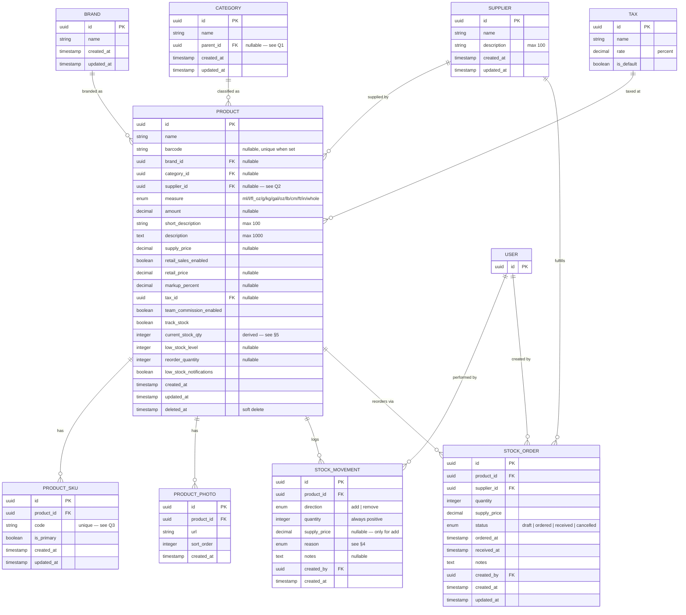

# Product Module — ERD & Data Model

**Status**: Draft v1 (derived from Fresha reference screenshots, 2026-05-20)
**Owner**: Hussain Shabbir
**Scope**: Data model only — UI/flow specs covered separately

---

## 1. Module overview

The Product module manages a partner's inventory of saleable / usable goods. A product belongs to a **Brand** and a **Category**, is sourced from a **Supplier**, can be tracked by one or more **SKUs**, has zero or more **Photos**, and accumulates **Stock Movements** (add / remove) over time. Each product has a **Pricing** profile (supply + retail) and **Inventory** rules (track stock, low-stock thresholds, reorder qty).

Reference: Fresha. UI patterns + baseline data shape only — naming and conventions follow cami.

---

## 2. ERD (Mermaid)

---

## 3. Entities

### 3.1 `Product` — core entity
Single row per physical/SKU item the partner stocks or sells. Holds basic info, pricing, and inventory configuration.

| Field | Type | Required | Notes |
|---|---|---|---|
| `id` | uuid | ✓ | PK |
| `name` | string | ✓ | "Product name" — shown in list |
| `barcode` | string | – | Optional. UPC/EAN/GTIN. Unique when present. UI warns "may be invalid" if format is off |
| `brand_id` | uuid | – | FK → `Brand` |
| `category_id` | uuid | – | FK → `Category` |
| `supplier_id` | uuid | – | FK → `Supplier`. **One supplier per product** (see Q2) |
| `measure` | enum | ✓ | See §4 — defaults to `ml` |
| `amount` | decimal | – | Quantity in the chosen unit (e.g., 250 ml). Pairs with `measure` |
| `short_description` | string(100) | – | Counter shown in UI: `0/100` |
| `description` | text(1000) | – | Counter shown: `0/1000` |
| `supply_price` | decimal | – | Default cost when adding stock. Optional |
| `retail_sales_enabled` | bool | ✓ | Toggles `retail_price` / `markup_percent` / `tax_id` |
| `retail_price` | decimal | – | Sale price |
| `markup_percent` | decimal | – | Derived from `(retail - supply) / supply` but editable both ways |
| `tax_id` | uuid | – | FK → `Tax`. UI default "No tax" |
| `team_commission_enabled` | bool | ✓ | Default false |
| `track_stock` | bool | ✓ | When false, no inventory bookkeeping |
| `current_stock_qty` | int | – | **Stored, kept in sync via stock movements** (see §5) |
| `low_stock_level` | int | – | Threshold for low-stock notification |
| `reorder_quantity` | int | – | Default qty pre-filled on reorder |
| `low_stock_notifications` | bool | ✓ | Default false |
| `created_at`, `updated_at` | timestamp | ✓ | |
| `deleted_at` | timestamp | – | Soft delete — "All data associated with this product will be permanently deleted" copy implies hard delete UX, but recommend soft delete for audit (see Q5) |

### 3.2 `Brand`
Operator-managed list. Reachable via *Options → Manage my brands* and via the "Select a brand" / "Add a brand" dialog inside the product form.

| Field | Type | Notes |
|---|---|---|
| `id` | uuid | |
| `name` | string | Unique per partner |

Computed: `products_count` (shown as "N products" in the list).

### 3.3 `Category`
Operator-managed list. Same pattern as Brand. Hierarchy not visible in screenshots — see **Q1**.

### 3.4 `Supplier`
Operator-managed list. Add form has `name` + `description` (max 100).

### 3.5 `Tax`
Referenced by product but managed elsewhere (settings module). UI shows "Default: No tax" / "No tax" — implies a partner-level default tax can be configured, and per-product override is allowed.

### 3.6 `ProductSku`
A product can have **multiple SKU codes** ("Add another SKU code"). One is flagged `is_primary` — that's the SKU shown in *Stock info → Primary SKU*. "Generate SKU automatically" produces a value like `WEF-98290` (likely `<barcode-or-name-slug>-<random>`).

### 3.7 `ProductPhoto`
Multiple photos per product. Drag-to-reorder ⇒ `sort_order` field. The first (or `sort_order = 0`) is rendered with the "Main photo" badge — no separate `is_main` flag needed.

### 3.8 `StockMovement` — history of add/remove
Append-only ledger feeding *Stock history* and computing `current_stock_qty`.

- `direction` is `add` or `remove`
- `quantity` is always positive; sign is implied by `direction`
- `supply_price` is captured at `add` time (the dialog has "Save price for next time" — when checked, also updates `Product.supply_price`)
- `reason` enum varies by direction (see §4)

### 3.9 `StockOrder`
Backs *Stock orders* tab and "Order stock" action. Not all fields are visible from screenshots — schema above is a reasonable starting set; refine when the order flow is designed.

---

## 4. Enums

### 4.1 `Measure`
From the dropdown: `ml`, `l`, `fl_oz`, `g`, `kg`, `gal`, `oz`, `lb`, `cm`, `ft`, `in`, `whole`.

### 4.2 `StockMovement.direction`
`add` | `remove`.

### 4.3 `StockMovement.reason`
- **Add** (visible in dropdown): `new_stock`, `return`, `transfer`, `adjustment`, `other`
- **Remove** (only `internal_use` visible — see **Q4** for full list)

### 4.4 `StockOrder.status`
`draft` | `ordered` | `received` | `cancelled` *(proposed — confirm with order-flow design)*.

---

## 5. Derived / computed fields

Shown in the *Stock info* card on the product detail panel. All can be computed on read or cached on the `Product` row.

| Field | Formula |
|---|---|
| `stock_on_hand` | `current_stock_qty` (kept in sync with movements) |
| `total_retail_value` | `current_stock_qty * retail_price` |
| `total_supply_value` | `current_stock_qty * supply_price` |
| `average_cost` | weighted average of `supply_price` across all `add` movements that remain on hand (moving-average inventory method) |
| `total_cost` | `current_stock_qty * average_cost` |

Recommended implementation: store `current_stock_qty` + `average_cost` on `Product`, update transactionally whenever a `StockMovement` is written. Recompute on demand from the ledger as a reconciliation job.

---

## 6. Relationships summary

| From | Cardinality | To | Notes |
|---|---|---|---|
| Product | N:1 | Brand | Optional |
| Product | N:1 | Category | Optional |
| Product | N:1 | Supplier | Optional — see Q2 |
| Product | N:1 | Tax | Optional |
| Product | 1:N | ProductSku | At least 1 (primary) when `track_stock = true` |
| Product | 1:N | ProductPhoto | 0..N, ordered |
| Product | 1:N | StockMovement | Append-only ledger |
| Product | 1:N | StockOrder | Reorder history |
| Supplier | 1:N | StockOrder | |
| User | 1:N | StockMovement / StockOrder | `created_by` audit |

---

## 7. Indexes & constraints

- `Product.barcode` — unique (when not null), indexed for "Search by product name or barcode"
- `Product.name` — indexed (search + A-Z sort)
- `ProductSku.code` — unique (scoped per partner — see Q3)
- `(Product.partner_id, Product.name)` — composite index for list sort
- `StockMovement.product_id, created_at` — composite for history pagination
- Soft-delete-aware unique indexes where applicable

> **Multi-tenancy**: every table above is scoped per partner. A `partner_id` column (or equivalent tenant key) should be added to every root entity. Omitted from the ERD above for clarity but is required.

---

## 8. List view — sortable columns

From the sort dropdown, these fields must be queryable + indexed:

`name`, `created_at`, `updated_at`, `current_stock_qty`, `category.name`, `supplier.name`, `retail_price`.

---

## 9. Out of scope (linked, not modeled here)

- **Sales** — the "Sell product" action and "Sales" tab plug into the broader checkout/orders module
- **Tax** management UI — owned by settings
- **Team-member commission** rules — owned by team module
- **Import/Export** (CSV/Excel) — implementation detail, no schema impact beyond `Product` itself

---

## 10. Open questions

| # | Question | Why it matters |
|---|---|---|
| **Q1** | Are categories hierarchical (parent/child) or flat? | Affects `Category.parent_id` and category-picker UI |
| **Q2** | One supplier per product, or many? Fresha screen shows one — confirm. | Drives `supplier_id` vs `product_supplier` join table |
| **Q3** | SKU uniqueness — globally (per partner) or only within a product? | Affects unique constraint and SKU-generation collision logic |
| **Q4** | Full list of "Remove stock" reasons? Only `Internal use` was visible. Likely: damaged, expired, lost, transfer, other. | Enum completeness |
| **Q5** | Hard delete or soft delete? Delete dialog copy says "permanently deleted" but stock history + sales references usually require soft delete. | Data retention & audit |
| **Q6** | Can a product exist without a brand / category / supplier? | Nullable FKs vs required |
| **Q7** | Is `current_stock_qty` stored or always computed from movements? | Performance vs simplicity |
| **Q8** | Max photos per product? Photo size/format constraints? | Storage planning |
| **Q9** | Does "Save price for next time" update `Product.supply_price` globally, or just remember it for the next *Add stock* dialog session? | UX subtlety with schema impact |
| **Q10** | Are there per-branch stock levels (multi-location partners), or single stock per partner? | If multi-location: introduce `ProductStock` (product × location) |

---

## 11. Glossary

- **SKU** — Stock Keeping Unit; internal code identifying a specific sellable variant
- **Supply price** — what the partner pays the supplier
- **Retail price** — what the customer pays
- **Markup** — `(retail - supply) / supply * 100`
- **Stock on hand** — current physical quantity in inventory
- **Average cost** — moving-average cost basis for valuation
